# 15-Puzzle AI Algorithm Simulator

[](https://github.com/JasonTM17/AI_Algothrithm_Study_University/actions/workflows/quality.yml)


**Tác giả:** JasonTM17

Ứng dụng Streamlit để học và bảo vệ đồ án Trí tuệ nhân tạo qua 15-puzzle. Repo không chỉ in ra đáp án; nó trình bày `state`, `action`, `frontier`, `reached`, heuristic, trace, certificate, GIF chạy thật và ranh giới học thuật của từng nhóm thuật toán.

<p align="center">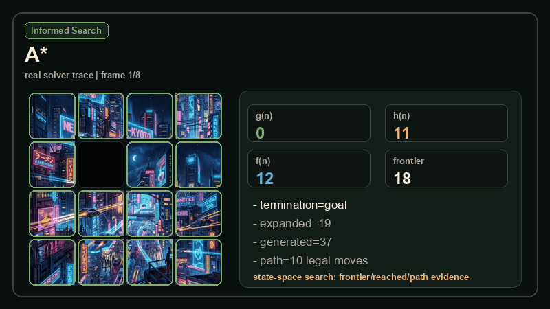</p>

GIF hero ở trên được sinh lại từ solver thật: A* Search, Manhattan Distance, `f(n)=g(n)+h(n)`, legal blank moves và image tiles đi theo cùng trajectory.

## Mục Lục

- [Chạy Nhanh](#chạy-nhanh)
- [Bản Đồ 6 Nhóm](#bản-đồ-6-nhóm)
- [Cách Đọc Từng Nhóm](#cách-đọc-từng-nhóm)
- [Atlas 28 Thuật Toán Có GIF Chạy Thật](#atlas-28-thuật-toán-có-gif-chạy-thật)
- [Cách Đọc Evidence](#cách-đọc-evidence)
- [Workflow Bảo Vệ Đồ Án](#workflow-bảo-vệ-đồ-án)
- [Tái Tạo GIF Và Kiểm Thử](#tái-tạo-gif-và-kiểm-thử)
- [Tài Liệu](#tài-liệu)

## Chạy Nhanh

```bash
python -m venv .venv
source .venv/bin/activate
pip install -r requirements.txt
streamlit run app.py
```

Windows PowerShell:

```powershell
python -m venv .venv
.\.venv\Scripts\Activate.ps1
pip install -r requirements.txt
streamlit run app.py
```

Kiểm tra phát triển:

```bash
pip install -r requirements-dev.txt
python -m compileall -q app.py core algorithms ui scripts
python scripts/generate-readme-gifs.py --check --check-readability
python -m pytest tests -q --cov=core --cov=algorithms --cov-report=term-missing --cov-fail-under=65
```

## Bản Đồ 6 Nhóm

`ALGORITHM_GROUPS` là contract chính: 6 nhóm, 28 thuật toán. Mỗi GIF dưới đây là một run thật, không phải mockup.

### Uninformed Search

<p>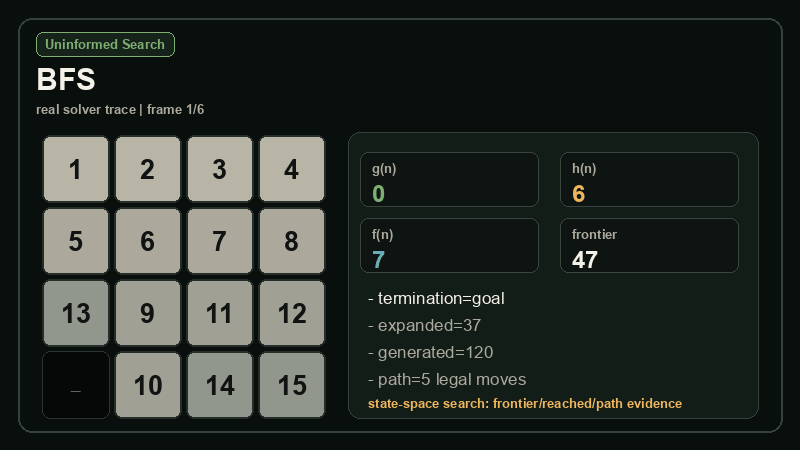</p>

- **Vai trò:** Duyet state-space without heuristic; evidence focuses on frontier/reached and legal path.
- **Câu hỏi học thuật:** If every move costs 1 and no domain estimate is used, how does queue discipline change behavior?
- **Thuật toán:** BFS, DFS, UCS, IDS

### Informed Search

<p>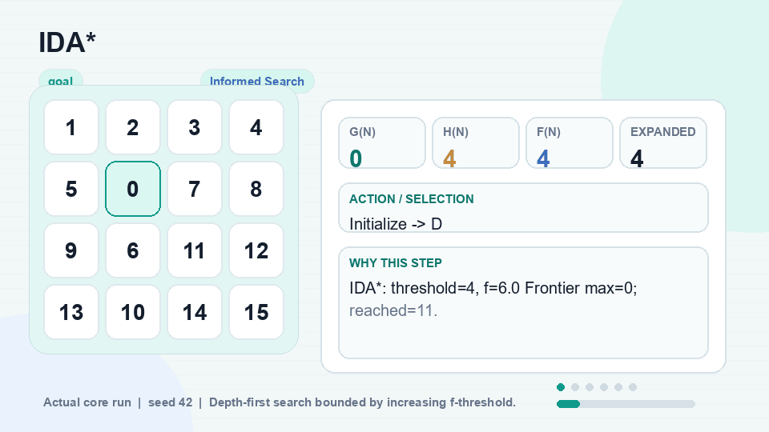</p>

- **Vai trò:** Add h(n), then combine with g(n) for optimal informed search.
- **Câu hỏi học thuật:** When is a heuristic only fast, and when does it justify an optimality certificate?
- **Thuật toán:** Greedy Best-First, A*, IDA*

### Local Search

<p>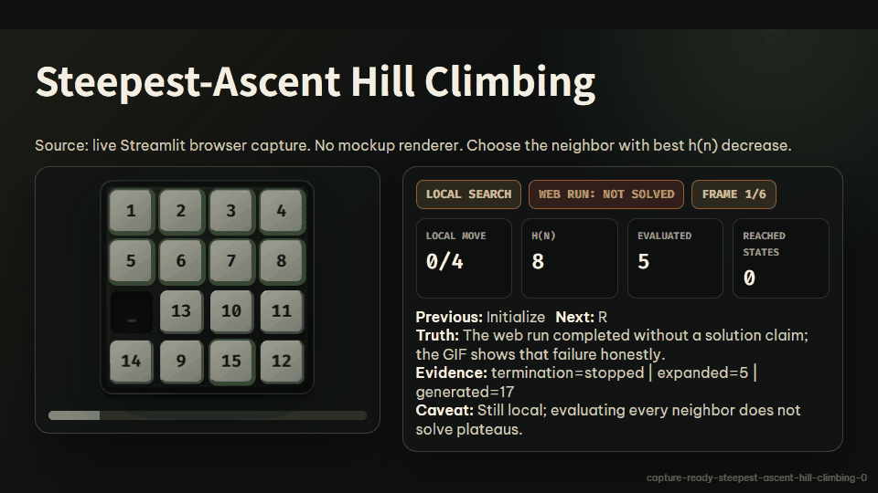</p>

- **Vai trò:** Show candidate-level choices without treating the run as guaranteed path search.
- **Câu hỏi học thuật:** Which neighbor was considered, chosen, rejected or accepted probabilistically?
- **Thuật toán:** Simple Hill Climbing, Steepest-Ascent Hill Climbing, Stochastic Hill Climbing, Random-Restart Hill Climbing, Local Beam Search, Simulated Annealing

### Complex Environments

<p>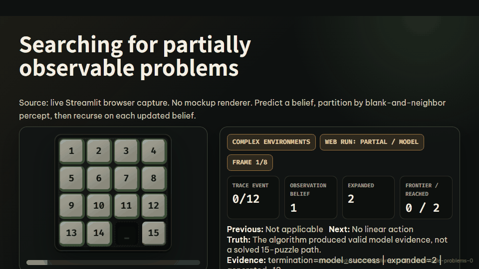</p>

- **Vai trò:** Model conditional, belief-state and online variants that extend the basic 15-puzzle PEAS.
- **Câu hỏi học thuật:** What does the agent know, and is the output a path, a policy or an online trace?
- **Thuật toán:** AND-OR Search, Searching with no observation, Searching for partially observable problems, LRTA*

### CSP

<p>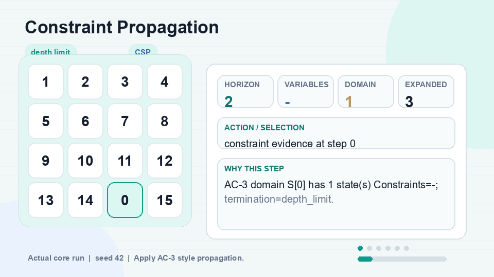</p>

- **Vai trò:** Reframe puzzle planning as variables, domains and constraints.
- **Câu hỏi học thuật:** Which variable/domain/constraint evidence is being shown instead of a shortest path claim?
- **Thuật toán:** CSP Definition, Constraint Propagation, Path Consistency, Global Constraints, Backtracking Search, Min-Conflicts, Constraint Graphs

### AI-vs-AI Tournament

<p>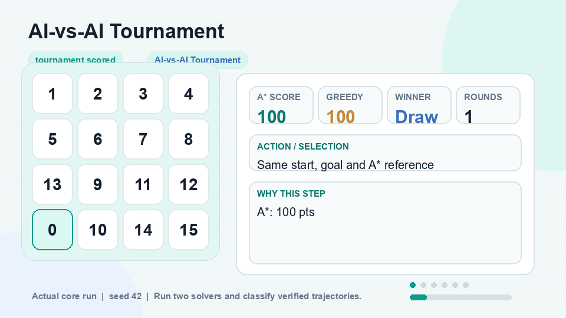</p>

- **Vai trò:** Compare agents, robustness and chance models without pretending the puzzle has a natural opponent.
- **Câu hỏi học thuật:** Is this a scored benchmark, a worst-case branch or an expected-value model?
- **Thuật toán:** AI-vs-AI Tournament, Minimax, Alpha-Beta Pruning, Expectimax

## Cách Đọc Từng Nhóm

| Nhóm | Cách đọc đúng | Sai lầm cần tránh |
|---|---|---|
| Uninformed Search | So sánh FIFO, LIFO, cost queue và iterative deepening khi không có h(n). | Gọi DFS là optimal hoặc quên memory của BFS. |
| Informed Search | Đọc h(n), g(n), f(n), admissible/consistent và certificate. | Gọi Greedy là optimal chỉ vì một run tình cờ ngắn. |
| Local Search | Xem candidate được xét/chọn/từ chối và lý do dừng. | Nhầm legal trajectory thành solution path. |
| Complex Environments | Đọc belief, conditional plan, online update theo đúng mô hình mở rộng. | Ép AND-OR/belief thành đường đi tuyến tính giả. |
| CSP | Đọc variables, domains, constraints, propagation và horizon. | Gọi CSP model definition là shortest-path solver. |
| AI-vs-AI Tournament | Đọc scoring, robustness, pruning và expected value. | Gọi MIN là đối thủ thật của 15-puzzle. |

## Atlas 28 Thuật Toán Có GIF Chạy Thật

Mỗi mục dưới đây có GIF riêng. GIF được tạo từ `scripts/generate-readme-gifs.py`, dùng start/goal/seed/resource limit cố định và được khóa bằng manifest semantic.

## Uninformed Search: từng thuật toán

### 1. BFS

<p></p>

| Trục đọc | Nội dung |
|---|---|
| Nhóm | Uninformed Search |
| Vai trò | Standard solver |
| Learning goal | Understand level-order expansion and why unit-cost BFS can certify shortest paths. |
| Cơ chế | FIFO frontier over puzzle states. |
| Evidence trong GIF | frontier size, reached set, legal path and path cost. |
| Guarantee | Complete and optimal for unit step cost if resources suffice. |
| Caveat | Memory grows quickly; good for shallow teaching cases, not deep 15-puzzle production search. |
| Demo input | seed `42`, termination `goal`, default demo parameters |
| Certificate flags | `path_verified=True`, `goal_reached=True`, `optimality_proven=True` |

Khi thuyết trình:

1. Nói rõ state/action/cost model trước khi giải thích hình.
2. Chỉ vào evidence chính trên GIF: frontier, reached, candidate, belief, domain, utility hoặc score.
3. Kết thúc bằng guarantee và caveat để không claim quá mức.

### 2. DFS

<p></p>

| Trục đọc | Nội dung |
|---|---|
| Nhóm | Uninformed Search |
| Vai trò | Contrast demo |
| Learning goal | See how depth-first commitment differs from optimal state-space search. |
| Cơ chế | LIFO stack with depth-aware duplicate handling. |
| Evidence trong GIF | expanded nodes, depth limit and legal trajectory when present. |
| Guarantee | No shortest-path guarantee in this app setting. |
| Caveat | Can chase a deep branch and miss a shorter path. |
| Demo input | seed `42`, termination `goal`, `max_depth=12` |
| Certificate flags | `path_verified=True`, `goal_reached=True`, `optimality_proven=False` |

Khi thuyết trình:

1. Nói rõ state/action/cost model trước khi giải thích hình.
2. Chỉ vào evidence chính trên GIF: frontier, reached, candidate, belief, domain, utility hoặc score.
3. Kết thúc bằng guarantee và caveat để không claim quá mức.

### 3. UCS

<p></p>

| Trục đọc | Nội dung |
|---|---|
| Nhóm | Uninformed Search |
| Vai trò | Standard solver |
| Learning goal | Connect path cost g(n) to optimal search. |
| Cơ chế | Priority queue ordered by cumulative path cost. |
| Evidence trong GIF | g(n), frontier, reached and cost certificate. |
| Guarantee | Complete and optimal for non-negative costs. |
| Caveat | On unit-cost 15-puzzle it behaves like BFS but keeps the general cost model explicit. |
| Demo input | seed `42`, termination `goal`, default demo parameters |
| Certificate flags | `path_verified=True`, `goal_reached=True`, `optimality_proven=True` |

Khi thuyết trình:

1. Nói rõ state/action/cost model trước khi giải thích hình.
2. Chỉ vào evidence chính trên GIF: frontier, reached, candidate, belief, domain, utility hoặc score.
3. Kết thúc bằng guarantee và caveat để không claim quá mức.

### 4. IDS

<p></p>

| Trục đọc | Nội dung |
|---|---|
| Nhóm | Uninformed Search |
| Vai trò | Standard solver |
| Learning goal | Trade BFS optimality for DFS-like memory by increasing the depth limit. |
| Cơ chế | Repeated depth-limited DFS with cutoff tracking. |
| Evidence trong GIF | depth limit, cutoff/exhausted reason and legal path. |
| Guarantee | Complete and optimal for unit step cost if the limit reaches the solution depth. |
| Caveat | Repeats work across iterations; the trace should be read by limit, not as one queue. |
| Demo input | seed `42`, termination `goal`, `max_depth=12` |
| Certificate flags | `path_verified=True`, `goal_reached=True`, `optimality_proven=True` |

Khi thuyết trình:

1. Nói rõ state/action/cost model trước khi giải thích hình.
2. Chỉ vào evidence chính trên GIF: frontier, reached, candidate, belief, domain, utility hoặc score.
3. Kết thúc bằng guarantee và caveat để không claim quá mức.

## Informed Search: từng thuật toán

### 5. Greedy Best-First

<p></p>

| Trục đọc | Nội dung |
|---|---|
| Nhóm | Informed Search |
| Vai trò | Contrast demo |
| Learning goal | Show why h(n) alone is fast but not a certificate. |
| Cơ chế | Priority queue ordered only by heuristic h(n). |
| Evidence trong GIF | selected h(n), frontier and whether the final path reaches goal. |
| Guarantee | No optimality guarantee. |
| Caveat | May find a longer path or get misled by a locally attractive state. |
| Demo input | seed `42`, termination `goal`, default demo parameters |
| Certificate flags | `path_verified=True`, `goal_reached=True`, `optimality_proven=False` |

Khi thuyết trình:

1. Nói rõ state/action/cost model trước khi giải thích hình.
2. Chỉ vào evidence chính trên GIF: frontier, reached, candidate, belief, domain, utility hoặc score.
3. Kết thúc bằng guarantee và caveat để không claim quá mức.

### 6. A*

<p></p>

| Trục đọc | Nội dung |
|---|---|
| Nhóm | Informed Search |
| Vai trò | Standard solver |
| Learning goal | Read f(n)=g(n)+h(n) and the Manhattan optimality condition. |
| Cơ chế | Priority queue ordered by g(n)+h(n). |
| Evidence trong GIF | g/h/f, expanded/generated/frontier, legal path and optimality flag. |
| Guarantee | Optimal with admissible and consistent heuristic when resources do not stop the run. |
| Caveat | The certificate is valid only for the selected goal and heuristic contract. |
| Demo input | seed `42`, termination `goal`, default demo parameters |
| Certificate flags | `path_verified=True`, `goal_reached=True`, `optimality_proven=True` |

Khi thuyết trình:

1. Nói rõ state/action/cost model trước khi giải thích hình.
2. Chỉ vào evidence chính trên GIF: frontier, reached, candidate, belief, domain, utility hoặc score.
3. Kết thúc bằng guarantee và caveat để không claim quá mức.

### 7. IDA*

<p></p>

| Trục đọc | Nội dung |
|---|---|
| Nhóm | Informed Search |
| Vai trò | Standard solver |
| Learning goal | Combine A* evaluation with memory-bounded iterative thresholds. |
| Cơ chế | Depth-first search bounded by increasing f-threshold. |
| Evidence trong GIF | threshold, reached metric, legal path and optimality flag. |
| Guarantee | Optimal with admissible heuristic and sufficient threshold iterations. |
| Caveat | May revisit many states; trace is threshold-based, not a single frontier queue. |
| Demo input | seed `42`, termination `goal`, default demo parameters |
| Certificate flags | `path_verified=True`, `goal_reached=True`, `optimality_proven=True` |

Khi thuyết trình:

1. Nói rõ state/action/cost model trước khi giải thích hình.
2. Chỉ vào evidence chính trên GIF: frontier, reached, candidate, belief, domain, utility hoặc score.
3. Kết thúc bằng guarantee và caveat để không claim quá mức.

## Local Search: từng thuật toán

### 8. Simple Hill Climbing

<p></p>

| Trục đọc | Nội dung |
|---|---|
| Nhóm | Local Search |
| Vai trò | Contrast demo |
| Learning goal | Watch the first improving candidate win or the search stop. |
| Cơ chế | Scan neighbors and move to the first lower h(n). |
| Evidence trong GIF | candidate h, selected action and stop reason. |
| Guarantee | No completeness or optimality guarantee. |
| Caveat | Local optimum can stop the run far from the goal. |
| Demo input | seed `42`, termination `stopped`, `max_iterations=40` |
| Certificate flags | `path_verified=True`, `goal_reached=False`, `optimality_proven=False` |

Khi thuyết trình:

1. Nói rõ state/action/cost model trước khi giải thích hình.
2. Chỉ vào evidence chính trên GIF: frontier, reached, candidate, belief, domain, utility hoặc score.
3. Kết thúc bằng guarantee và caveat để không claim quá mức.

### 9. Steepest-Ascent Hill Climbing

<p></p>

| Trục đọc | Nội dung |
|---|---|
| Nhóm | Local Search |
| Vai trò | Contrast demo |
| Learning goal | Compare all local neighbors before moving. |
| Cơ chế | Choose the neighbor with best h(n) decrease. |
| Evidence trong GIF | evaluated candidates, best candidate and reject/accept reason. |
| Guarantee | No completeness or optimality guarantee. |
| Caveat | Still local; evaluating every neighbor does not solve plateaus. |
| Demo input | seed `42`, termination `stopped`, `max_iterations=40` |
| Certificate flags | `path_verified=True`, `goal_reached=False`, `optimality_proven=False` |

Khi thuyết trình:

1. Nói rõ state/action/cost model trước khi giải thích hình.
2. Chỉ vào evidence chính trên GIF: frontier, reached, candidate, belief, domain, utility hoặc score.
3. Kết thúc bằng guarantee và caveat để không claim quá mức.

### 10. Stochastic Hill Climbing

<p></p>

| Trục đọc | Nội dung |
|---|---|
| Nhóm | Local Search |
| Vai trò | Contrast demo |
| Learning goal | See randomness among improving candidates. |
| Cơ chế | Sample one improving move using a fixed seed. |
| Evidence trong GIF | candidate pool, chosen action, seed and legal trajectory. |
| Guarantee | No deterministic optimality guarantee. |
| Caveat | Different seeds can produce different partial trajectories. |
| Demo input | seed `42`, termination `stopped`, `max_iterations=40`, `seed=7` |
| Certificate flags | `path_verified=True`, `goal_reached=False`, `optimality_proven=False` |

Khi thuyết trình:

1. Nói rõ state/action/cost model trước khi giải thích hình.
2. Chỉ vào evidence chính trên GIF: frontier, reached, candidate, belief, domain, utility hoặc score.
3. Kết thúc bằng guarantee và caveat để không claim quá mức.

### 11. Random-Restart Hill Climbing

<p></p>

| Trục đọc | Nội dung |
|---|---|
| Nhóm | Local Search |
| Vai trò | Contrast demo |
| Learning goal | Use restarts to escape one bad local basin. |
| Cơ chế | Run multiple hill climbs from deterministic restart states. |
| Evidence trong GIF | restart index, best h(n) and selected trajectory. |
| Guarantee | Still not a complete 15-puzzle solver here. |
| Caveat | More restarts improve chances but do not prove optimality. |
| Demo input | seed `42`, termination `stopped`, `max_iterations=40`, `seed=7`, `max_restarts=3` |
| Certificate flags | `path_verified=True`, `goal_reached=False`, `optimality_proven=False` |

Khi thuyết trình:

1. Nói rõ state/action/cost model trước khi giải thích hình.
2. Chỉ vào evidence chính trên GIF: frontier, reached, candidate, belief, domain, utility hoặc score.
3. Kết thúc bằng guarantee và caveat để không claim quá mức.

### 12. Local Beam Search

<p></p>

| Trục đọc | Nội dung |
|---|---|
| Nhóm | Local Search |
| Vai trò | Contrast demo |
| Learning goal | Track several local candidates at once. |
| Cơ chế | Keep k best states per iteration. |
| Evidence trong GIF | beam width, candidate scores and selected beam states. |
| Guarantee | No optimality guarantee. |
| Caveat | The beam can collapse to similar states and miss the global route. |
| Demo input | seed `42`, termination `goal`, `max_iterations=40`, `beam_width=3` |
| Certificate flags | `path_verified=True`, `goal_reached=True`, `optimality_proven=False` |

Khi thuyết trình:

1. Nói rõ state/action/cost model trước khi giải thích hình.
2. Chỉ vào evidence chính trên GIF: frontier, reached, candidate, belief, domain, utility hoặc score.
3. Kết thúc bằng guarantee và caveat để không claim quá mức.

### 13. Simulated Annealing

<p></p>

| Trục đọc | Nội dung |
|---|---|
| Nhóm | Local Search |
| Vai trò | Contrast demo |
| Learning goal | Understand probabilistic acceptance of worse moves. |
| Cơ chế | Temperature-controlled accept/reject over neighbors. |
| Evidence trong GIF | temperature, probability, accepted flag and legal trajectory. |
| Guarantee | No certificate of reaching or optimizing the goal. |
| Caveat | A legal trajectory is not automatically a solution. |
| Demo input | seed `42`, termination `stopped`, `max_iterations=40`, `seed=7` |
| Certificate flags | `path_verified=True`, `goal_reached=False`, `optimality_proven=False` |

Khi thuyết trình:

1. Nói rõ state/action/cost model trước khi giải thích hình.
2. Chỉ vào evidence chính trên GIF: frontier, reached, candidate, belief, domain, utility hoặc score.
3. Kết thúc bằng guarantee và caveat để không claim quá mức.

## Complex Environments: từng thuật toán

### 14. AND-OR Search

<p></p>

| Trục đọc | Nội dung |
|---|---|
| Nhóm | Complex Environments |
| Vai trò | Extension |
| Learning goal | Read a conditional plan under possible outcome deflections. |
| Cơ chế | OR chooses action; AND requires subplans for supported outcomes. |
| Evidence trong GIF | conditional branches, depth limit and deflection support mode. |
| Guarantee | Returns a policy-like conditional plan, not a linear shortest path. |
| Caveat | The support switch is not probability weighting. |
| Demo input | seed `42`, termination `model_success`, `max_depth=2`, `nondet_prob=0.0` |
| Certificate flags | `path_verified=True`, `goal_reached=False`, `optimality_proven=False` |

Khi thuyết trình:

1. Nói rõ state/action/cost model trước khi giải thích hình.
2. Chỉ vào evidence chính trên GIF: frontier, reached, candidate, belief, domain, utility hoặc score.
3. Kết thúc bằng guarantee và caveat để không claim quá mức.

### 15. Searching with no observation

<p></p>

| Trục đọc | Nội dung |
|---|---|
| Nhóm | Complex Environments |
| Vai trò | Extension |
| Learning goal | Separate hidden actual state from belief-state decision making. |
| Cơ chế | Maintain a belief set when observations reveal no tile positions. |
| Evidence trong GIF | belief size, planner votes, fallback votes and action trace. |
| Guarantee | Demonstrates belief reasoning; not a standard full-observation solver. |
| Caveat | Hidden state is shown only as debug evidence. |
| Demo input | seed `42`, termination `stopped`, `max_steps=3`, `num_belief_states=4`, `known_positions={'14': 15}`, `seed=42` |
| Certificate flags | `path_verified=True`, `goal_reached=False`, `optimality_proven=False` |

Khi thuyết trình:

1. Nói rõ state/action/cost model trước khi giải thích hình.
2. Chỉ vào evidence chính trên GIF: frontier, reached, candidate, belief, domain, utility hoặc score.
3. Kết thúc bằng guarantee và caveat để không claim quá mức.

### 16. Searching for partially observable problems

<p></p>

| Trục đọc | Nội dung |
|---|---|
| Nhóm | Complex Environments |
| Vai trò | Extension |
| Learning goal | Use known tile positions to reduce the belief set. |
| Cơ chế | Filter belief candidates using a known-tile matrix. |
| Evidence trong GIF | known positions, belief size, planner votes and fallback reason. |
| Guarantee | Can propose legal actions under partial knowledge. |
| Caveat | With too few known tiles, the belief set can still be ambiguous. |
| Demo input | seed `42`, termination `goal`, `max_steps=3`, `num_belief_states=4`, `known_positions={'14': 15}`, `seed=42` |
| Certificate flags | `path_verified=True`, `goal_reached=True`, `optimality_proven=False` |

Khi thuyết trình:

1. Nói rõ state/action/cost model trước khi giải thích hình.
2. Chỉ vào evidence chính trên GIF: frontier, reached, candidate, belief, domain, utility hoặc score.
3. Kết thúc bằng guarantee và caveat để không claim quá mức.

### 17. LRTA*

<p>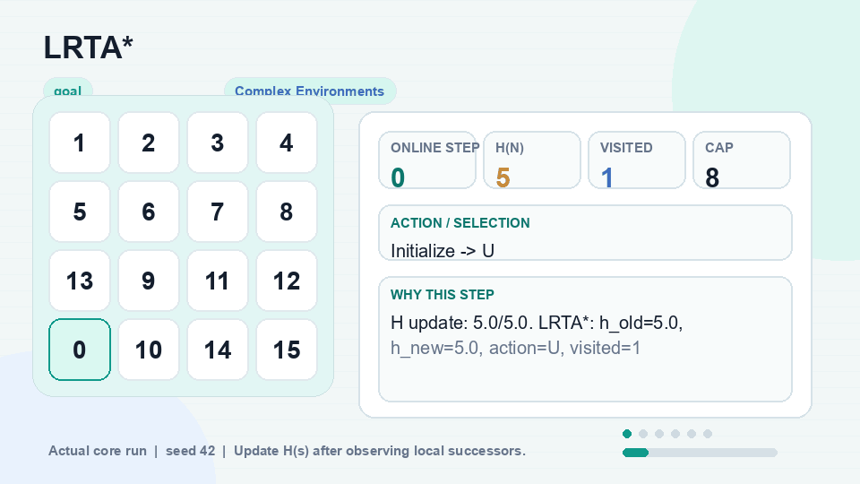</p>

| Trục đọc | Nội dung |
|---|---|
| Nhóm | Complex Environments |
| Vai trò | Extension |
| Learning goal | Study online heuristic learning one action at a time. |
| Cơ chế | Update H(s) after observing local successors. |
| Evidence trong GIF | online step, H update, chosen action and cap reason. |
| Guarantee | Online learning demo, not an offline optimal certificate. |
| Caveat | The node cap is a max online-step cap in the UI. |
| Demo input | seed `42`, termination `goal`, `max_steps=8` |
| Certificate flags | `path_verified=True`, `goal_reached=True`, `optimality_proven=False` |

Khi thuyết trình:

1. Nói rõ state/action/cost model trước khi giải thích hình.
2. Chỉ vào evidence chính trên GIF: frontier, reached, candidate, belief, domain, utility hoặc score.
3. Kết thúc bằng guarantee và caveat để không claim quá mức.

## CSP: từng thuật toán

### 18. CSP Definition

<p>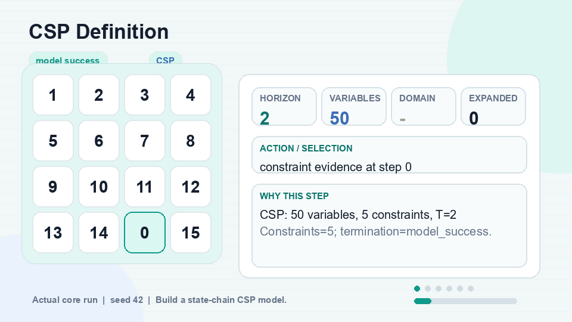</p>

| Trục đọc | Nội dung |
|---|---|
| Nhóm | CSP |
| Vai trò | Extension |
| Learning goal | Name variables, domains and constraints. |
| Cơ chế | Build a state-chain CSP model. |
| Evidence trong GIF | variables/domains/constraints count. |
| Guarantee | Model definition only. |
| Caveat | A model is not yet a solved trajectory. |
| Demo input | seed `42`, termination `model_success`, `time_horizon=2` |
| Certificate flags | `path_verified=False`, `goal_reached=False`, `optimality_proven=False` |

Khi thuyết trình:

1. Nói rõ state/action/cost model trước khi giải thích hình.
2. Chỉ vào evidence chính trên GIF: frontier, reached, candidate, belief, domain, utility hoặc score.
3. Kết thúc bằng guarantee và caveat để không claim quá mức.

### 19. Constraint Propagation

<p>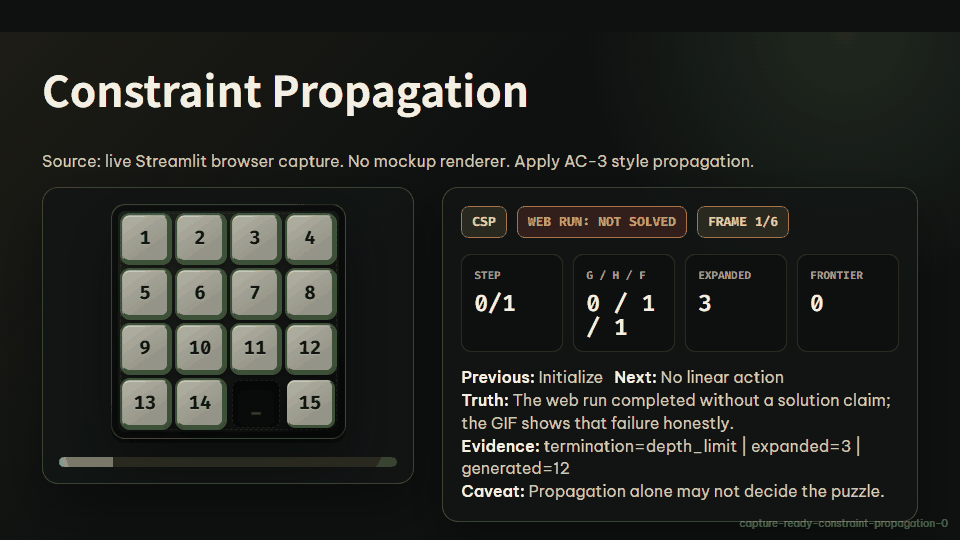</p>

| Trục đọc | Nội dung |
|---|---|
| Nhóm | CSP |
| Vai trò | Extension |
| Learning goal | See domains shrink before search. |
| Cơ chế | Apply AC-3 style propagation. |
| Evidence trong GIF | domain reductions and wipe-out status. |
| Guarantee | Sound pruning for represented constraints. |
| Caveat | Propagation alone may not decide the puzzle. |
| Demo input | seed `42`, termination `depth_limit`, `time_horizon=2` |
| Certificate flags | `path_verified=False`, `goal_reached=False`, `optimality_proven=False` |

Khi thuyết trình:

1. Nói rõ state/action/cost model trước khi giải thích hình.
2. Chỉ vào evidence chính trên GIF: frontier, reached, candidate, belief, domain, utility hoặc score.
3. Kết thúc bằng guarantee và caveat để không claim quá mức.

### 20. Path Consistency

<p>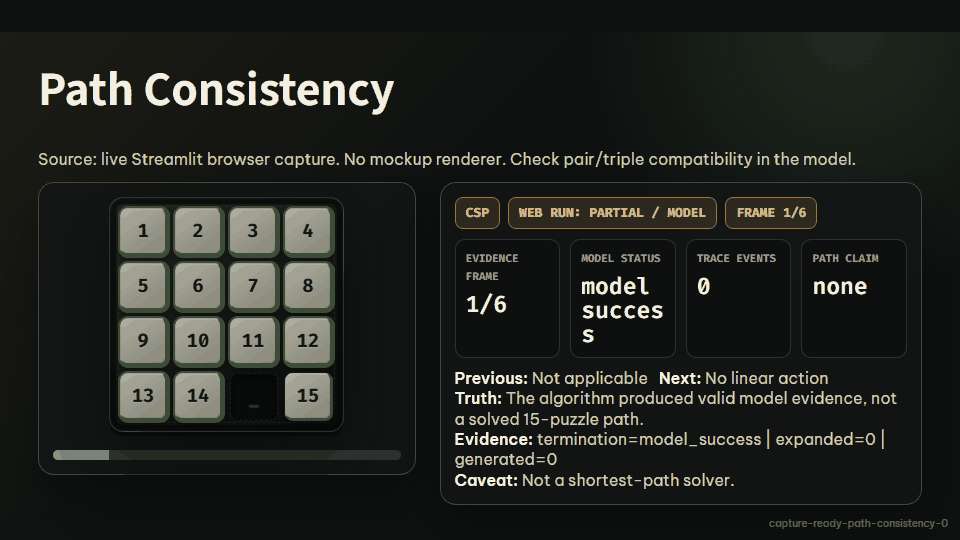</p>

| Trục đọc | Nội dung |
|---|---|
| Nhóm | CSP |
| Vai trò | Extension |
| Learning goal | Inspect consistency across triples of variables. |
| Cơ chế | Check pair/triple compatibility in the model. |
| Evidence trong GIF | consistency events and remaining domains. |
| Guarantee | Educational consistency evidence. |
| Caveat | Not a shortest-path solver. |
| Demo input | seed `42`, termination `model_success`, default demo parameters |
| Certificate flags | `path_verified=False`, `goal_reached=False`, `optimality_proven=False` |

Khi thuyết trình:

1. Nói rõ state/action/cost model trước khi giải thích hình.
2. Chỉ vào evidence chính trên GIF: frontier, reached, candidate, belief, domain, utility hoặc score.
3. Kết thúc bằng guarantee và caveat để không claim quá mức.

### 21. Global Constraints

<p>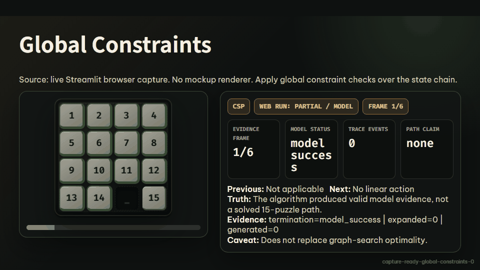</p>

| Trục đọc | Nội dung |
|---|---|
| Nhóm | CSP |
| Vai trò | Extension |
| Learning goal | Use all-different and structural constraints. |
| Cơ chế | Apply global constraint checks over the state chain. |
| Evidence trong GIF | constraint status and domain evidence. |
| Guarantee | Rules out impossible assignments. |
| Caveat | Does not replace graph-search optimality. |
| Demo input | seed `42`, termination `model_success`, default demo parameters |
| Certificate flags | `path_verified=False`, `goal_reached=False`, `optimality_proven=False` |

Khi thuyết trình:

1. Nói rõ state/action/cost model trước khi giải thích hình.
2. Chỉ vào evidence chính trên GIF: frontier, reached, candidate, belief, domain, utility hoặc score.
3. Kết thúc bằng guarantee và caveat để không claim quá mức.

### 22. Backtracking Search

<p>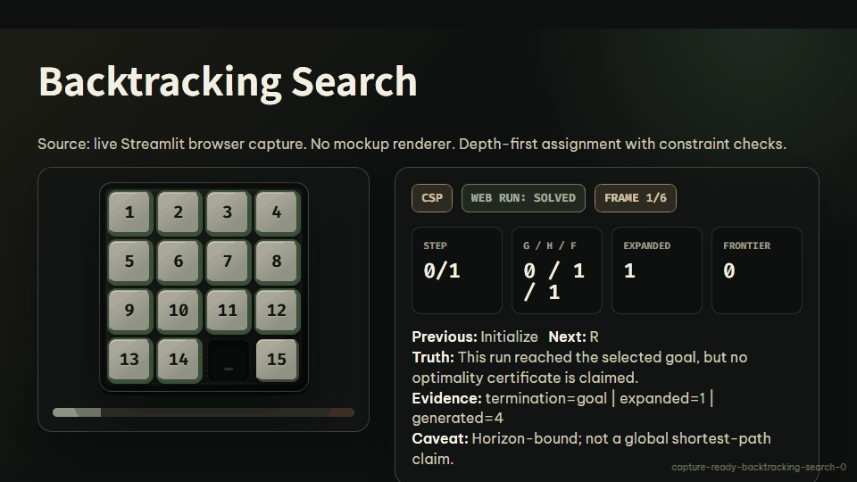</p>

| Trục đọc | Nội dung |
|---|---|
| Nhóm | CSP |
| Vai trò | Extension |
| Learning goal | Search assignments in the CSP model. |
| Cơ chế | Depth-first assignment with constraint checks. |
| Evidence trong GIF | assigned variables, backtrack reason and final path if found. |
| Guarantee | Can solve small exact-horizon demos. |
| Caveat | Horizon-bound; not a global shortest-path claim. |
| Demo input | seed `42`, termination `goal`, `max_steps=600` |
| Certificate flags | `path_verified=True`, `goal_reached=True`, `optimality_proven=False` |

Khi thuyết trình:

1. Nói rõ state/action/cost model trước khi giải thích hình.
2. Chỉ vào evidence chính trên GIF: frontier, reached, candidate, belief, domain, utility hoặc score.
3. Kết thúc bằng guarantee và caveat để không claim quá mức.

### 23. Min-Conflicts

<p></p>

| Trục đọc | Nội dung |
|---|---|
| Nhóm | CSP |
| Vai trò | Extension |
| Learning goal | Repair an assignment by reducing conflicts. |
| Cơ chế | Randomized local repair over CSP variables. |
| Evidence trong GIF | conflict count, selected variable and seed. |
| Guarantee | Useful concept for CSP repair. |
| Caveat | Better suited to N-Queens style CSPs than canonical 15-puzzle. |
| Demo input | seed `42`, termination `model_success`, `max_iterations=80` |
| Certificate flags | `path_verified=False`, `goal_reached=False`, `optimality_proven=False` |

Khi thuyết trình:

1. Nói rõ state/action/cost model trước khi giải thích hình.
2. Chỉ vào evidence chính trên GIF: frontier, reached, candidate, belief, domain, utility hoặc score.
3. Kết thúc bằng guarantee và caveat để không claim quá mức.

### 24. Constraint Graphs

<p>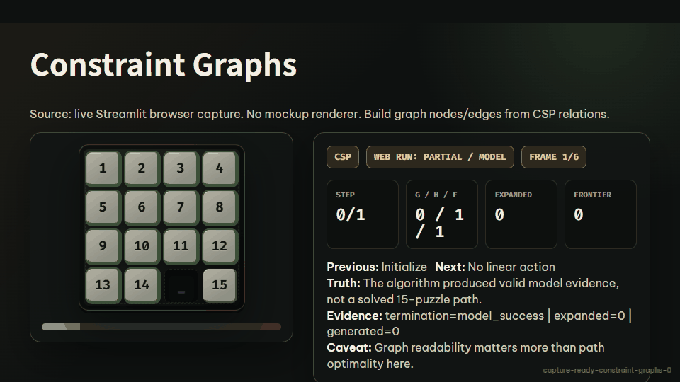</p>

| Trục đọc | Nội dung |
|---|---|
| Nhóm | CSP |
| Vai trò | Extension |
| Learning goal | Visualize variables as a constraint network. |
| Cơ chế | Build graph nodes/edges from CSP relations. |
| Evidence trong GIF | constraint graph summary and consistency evidence. |
| Guarantee | Explains structure, not a solver certificate. |
| Caveat | Graph readability matters more than path optimality here. |
| Demo input | seed `42`, termination `model_success`, `time_horizon=2` |
| Certificate flags | `path_verified=False`, `goal_reached=False`, `optimality_proven=False` |

Khi thuyết trình:

1. Nói rõ state/action/cost model trước khi giải thích hình.
2. Chỉ vào evidence chính trên GIF: frontier, reached, candidate, belief, domain, utility hoặc score.
3. Kết thúc bằng guarantee và caveat để không claim quá mức.

## AI-vs-AI Tournament: từng thuật toán

### 25. AI-vs-AI Tournament

<p></p>

| Trục đọc | Nội dung |
|---|---|
| Nhóm | AI-vs-AI Tournament |
| Vai trò | Scoring layer |
| Learning goal | Score two agents against the same A* reference. |
| Cơ chế | Run two solvers and classify verified trajectories. |
| Evidence trong GIF | points, optimal cost, excess cost and invalid-path penalties. |
| Guarantee | Fair benchmark when the reference certificate exists. |
| Caveat | Tournament is not a natural adversarial PEAS model. |
| Demo input | seed `42`, termination `tournament_scored`, default demo parameters |
| Certificate flags | `path_verified=True`, `goal_reached=False`, `optimality_proven=False` |

Khi thuyết trình:

1. Nói rõ state/action/cost model trước khi giải thích hình.
2. Chỉ vào evidence chính trên GIF: frontier, reached, candidate, belief, domain, utility hoặc score.
3. Kết thúc bằng guarantee và caveat để không claim quá mức.

### 26. Minimax

<p></p>

| Trục đọc | Nội dung |
|---|---|
| Nhóm | AI-vs-AI Tournament |
| Vai trò | Robustness demo |
| Learning goal | Interpret MIN as worst-case robustness, not a real puzzle opponent. |
| Cơ chế | Alternate MAX promising moves with MIN worst-case legal continuations. |
| Evidence trong GIF | MAX/MIN nodes, utility and selected root action. |
| Guarantee | Depth-limited worst-case decision rule. |
| Caveat | Both sides share legal blank moves because 15-puzzle has no natural adversary. |
| Demo input | seed `42`, termination `goal`, `depth=2` |
| Certificate flags | `path_verified=True`, `goal_reached=True`, `optimality_proven=False` |

Khi thuyết trình:

1. Nói rõ state/action/cost model trước khi giải thích hình.
2. Chỉ vào evidence chính trên GIF: frontier, reached, candidate, belief, domain, utility hoặc score.
3. Kết thúc bằng guarantee và caveat để không claim quá mức.

### 27. Alpha-Beta Pruning

<p></p>

| Trục đọc | Nội dung |
|---|---|
| Nhóm | AI-vs-AI Tournament |
| Vai trò | Robustness demo |
| Learning goal | Learn branch-and-bound pruning over the same worst-case tree. |
| Cơ chế | Prune branches that cannot change the minimax root value. |
| Evidence trong GIF | alpha, beta, pruned branches and root utility. |
| Guarantee | Same root value as full Minimax for the searched tree. |
| Caveat | Pruning saves nodes; it does not turn the puzzle into a real two-player game. |
| Demo input | seed `42`, termination `goal`, `depth=2` |
| Certificate flags | `path_verified=True`, `goal_reached=True`, `optimality_proven=False` |

Khi thuyết trình:

1. Nói rõ state/action/cost model trước khi giải thích hình.
2. Chỉ vào evidence chính trên GIF: frontier, reached, candidate, belief, domain, utility hoặc score.
3. Kết thúc bằng guarantee và caveat để không claim quá mức.

### 28. Expectimax

<p></p>

| Trục đọc | Nội dung |
|---|---|
| Nhóm | AI-vs-AI Tournament |
| Vai trò | Chance demo |
| Learning goal | Compare expected value against worst-case reasoning. |
| Cơ chế | Replace MIN with CHANCE outcomes and success probability. |
| Evidence trong GIF | CHANCE nodes, probabilities and expected utility. |
| Guarantee | Depth-limited expected-value policy under the chosen probability model. |
| Caveat | Probability model is educational and must be stated before interpreting the result. |
| Demo input | seed `42`, termination `goal`, `depth=2`, `success_prob=0.75`, `seed=11` |
| Certificate flags | `path_verified=True`, `goal_reached=True`, `optimality_proven=False` |

Khi thuyết trình:

1. Nói rõ state/action/cost model trước khi giải thích hình.
2. Chỉ vào evidence chính trên GIF: frontier, reached, candidate, belief, domain, utility hoặc score.
3. Kết thúc bằng guarantee và caveat để không claim quá mức.

## Cách Đọc Evidence

| Trường | Nghĩa |
|---|---|
| `path_verified` | Chuỗi action là legal blank moves. |
| `goal_reached` | State cuối bằng goal đã chọn. |
| `optimality_proven` | Chỉ true khi thuật toán optimal, path hợp lệ, tới goal và termination là `goal`. |
| `frontier` | Node đang chờ xét. |
| `reached` | State/record đã biết trong reached, best_g hoặc best_depth. |
| `g(n)` | Path cost từ start tới node. |
| `h(n)` | Heuristic estimate tới goal. |
| `f(n)` | Priority của A*: `g(n)+h(n)`. |
| `trace` | Bằng chứng từng bước: generate, expand, select, prune, accept/reject. |

Ba tầng chứng minh phải đọc riêng:

```text
Path legal       !=  Goal reached
Goal reached     !=  Optimal
Algorithm success !=  Solver chuẩn của 15-puzzle
```

## Workflow Bảo Vệ Đồ Án

### Demo 5 phút

1. Mở Play, chọn Puzzle ảnh và chạy A* từng bước.
2. Nói công thức `f(n)=g(n)+h(n)` và Manhattan Distance.
3. Mở Run Algorithm, chạy A* hoặc BFS, chỉ vào frontier/reached/search tree.
4. Mở Theory, chỉ bảng 6 nhóm và caveat solver chuẩn vs extension.
5. Kết luận bằng certificate: legal path, goal reached, optimality proven.

### Demo 15 phút

1. PEAS: single-agent, deterministic, fully observable, static, discrete, sequential.
2. Uninformed: BFS/UCS/IDS và trade-off memory/depth/cost.
3. Informed: Greedy vs A* vs IDA*, vì sao Greedy không đủ certificate.
4. Local Search: candidate evidence và local optimum.
5. Complex: AND-OR conditional plan, belief matrix `_`, LRTA* online update.
6. CSP: variables/domains/constraints, propagation và horizon caveat.
7. Group 6: Minimax/Alpha-Beta là robustness branch, Expectimax là chance model.
8. Tournament: dùng A* reference để chấm điểm solver, không phải đối thủ tự nhiên.

### Câu trả lời mẫu khi giảng viên hỏi

> Vì sao A* được claim optimal?

Vì 15-puzzle ở đây dùng unit step cost, Manhattan Distance là admissible/consistent, và `SearchResult` chỉ bật `optimality_proven=True` khi path legal, tới đúng goal, thuật toán optimal và termination là `goal`.

> Vì sao Local Search có GIF nhưng không gọi là solver chuẩn?

Vì local search chỉ xét neighborhood cục bộ; nó có thể tạo legal trajectory nhưng không đảm bảo tới goal hoặc shortest path. App hiển thị candidate/reject/accept để minh họa trade-off, không claim certificate.

> MIN trong Minimax là ai?

Không phải người chơi thật của 15-puzzle. MIN là nhánh phân tích worst-case robustness: nếu các legal continuations tiếp theo làm heuristic xấu nhất thì sao. Cả MAX/MIN dùng cùng legal blank moves vì puzzle không có adversary tự nhiên.

> AND-OR có dùng xác suất không?

Không. Trong app, `nondet_prob > 0` chỉ bật hỗ trợ outcome lệch hướng như một support switch. Nó không là probability weighting; output đúng là conditional plan.

## Tái Tạo GIF Và Kiểm Thử

```bash
python scripts/generate-readme-gifs.py --featured --profile all --theme light
python scripts/generate-readme-gifs.py --all --profile algorithm --theme light
python scripts/generate-readme-gifs.py --featured --profile all --theme dark
python scripts/generate-readme-gifs.py --check --check-readability
python scripts/generate-readme-gifs.py --contact-sheet
```

`--theme light` tạo bản sáng dễ đọc trên GitHub; `--theme dark` tạo bản tối đồng bộ với app Streamlit. Hai theme dùng cùng solver evidence, chỉ đổi palette hiển thị.

Quality gates:

```bash
python -m compileall -q app.py core algorithms ui scripts
python -m pytest tests -q --cov=core --cov=algorithms --cov-report=term-missing --cov-fail-under=65
git diff --check
```

## Tài Liệu

- [Algorithm demo gallery](docs/algorithm-demo-gallery.md)
- [Algorithm correctness matrix](docs/algorithm-correctness-matrix.md)
- [UI/UX evidence surfaces](docs/ui-ux-evidence-surfaces.md)
- [Known limitations](docs/known-limitations.md)
- [Deep bug audit](docs/deep-bug-audit.md)
- [Project overview/PDR](docs/project-overview-pdr.md)
- [Codebase summary](docs/codebase-summary.md)
- [System architecture](docs/system-architecture.md)
- [Algorithm test plan](docs/algorithm-test-plan.md)
- [Academic reference for groups](docs/algorithm-groups-academic-reference.md)
- [Project roadmap](docs/project-roadmap.md)
