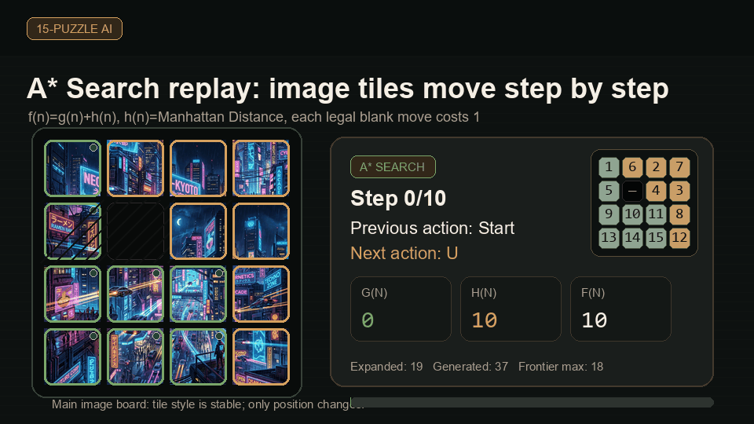

# 15-Puzzle AI Algorithm Simulator

Một phòng thí nghiệm Streamlit để học và bảo vệ đồ án Trí tuệ nhân tạo qua bài toán 15-puzzle. Dự án không chỉ cho thuật toán “chạy ra đáp án”; nó cố gắng cho người học nhìn thấy state, action, frontier, reached, heuristic, certificate và ranh giới học thuật của từng nhóm thuật toán.



GIF trên được tạo từ solver thật trong repo:

- Start state: `(1, 6, 2, 7, 5, 0, 4, 3, 9, 10, 11, 8, 13, 14, 15, 12)`
- Solver: `A* Search`
- Heuristic: `Manhattan Distance`
- Công thức: `f(n)=g(n)+h(n)`
- Path tối ưu: `10` bước
- Evidence: `19` nodes expanded, `37` nodes generated, frontier max `18`

## Mục tiêu

Dự án dùng 15-puzzle để học các ý tưởng AI nền tảng:

| Cần học | Dự án minh họa bằng gì |
|---|---|
| Agent và PEAS | Board 4x4, sensors, actuators, performance measure |
| State-space search | `state`, `action`, `transition`, `path cost`, `goal test` |
| Uninformed search | BFS, DFS, UCS, IDS |
| Informed search | Greedy, A*, IDA*, Manhattan, Linear Conflict |
| Local search | Hill Climbing, Beam, Simulated Annealing, candidate evidence |
| Môi trường phức tạp | AND-OR, belief state, partial observation, LRTA* |
| CSP | Variables, domains, constraints, propagation, bounded planning |
| Game/chance extension | Tournament, Minimax, Alpha-Beta, Expectimax |
| Kiểm chứng học thuật | Path legality, goal reached, optimality certificate, trace |

Điểm quan trọng: 15-puzzle chuẩn là bài toán một tác tử, xác định, quan sát đầy đủ, tĩnh, rời rạc và tuần tự. Vì vậy BFS, UCS, IDS, A*, IDA* là nhóm solver chuẩn. CSP, AND-OR, belief-state, LRTA*, Minimax, Alpha-Beta, Expectimax là phần mở rộng giáo dục, không nên gọi là solver tự nhiên của 15-puzzle chuẩn.

## Chạy nhanh

```bash
python -m venv .venv
source .venv/bin/activate
pip install -r requirements.txt
streamlit run app.py
```

Mở app tại:

```text
http://localhost:8501
```

Môi trường phát triển:

```bash
python -m venv .venv
source .venv/bin/activate
pip install -r requirements-dev.txt
python -m compileall -q app.py core algorithms ui
python -m pytest tests/ -q
```

Kiểm tra nhanh trên Windows PowerShell:

```powershell
python -m venv .venv
.\.venv\Scripts\Activate.ps1
python -m compileall -q app.py core algorithms ui
python -m pytest tests/ -q
```

## Cách dùng khi thuyết trình

| Bước | Tab | Nên trình bày |
|---|---|---|
| 1 | Play Puzzle | Start/Goal, ô trống `0`, solvability, board số hoặc puzzle ảnh, A* replay từng bước |
| 2 | Run Algorithm | Chọn nhóm thuật toán ở đầu trang, chạy một thuật toán, đọc frontier/reached/trace |
| 3 | Compare | So sánh nhiều solver với cùng seed, depth, timeout, heuristic |
| 4 | Trace từng bước | Đọc expansion trace, generated node, `g/h/f`, parent/child |
| 5 | Luyện chạy tay | Tự chọn node tiếp theo như khi làm bài thi |
| 6 | Lý thuyết PEAS | Bảo vệ mô hình agent, taxonomy, guarantee, caveat |
| 7 | Nâng cao | CSP, AND-OR, belief-state, LRTA*, tournament, game/chance concept |

Một câu bảo vệ gọn:

> Với 15-puzzle chuẩn, em dùng A* vì bài toán là deterministic, fully observable, unit-cost state-space search. A* dùng `f(n)=g(n)+h(n)`, với Manhattan Distance là heuristic admissible/consistent, nên khi không bị giới hạn tài nguyên và path được verify, kết quả có optimality certificate.

## Mô hình 15-puzzle chuẩn

| Thành phần | Diễn giải |
|---|---|
| State | Tuple 16 số, là hoán vị của `0..15`; `0` là ô trống |
| Goal mặc định | `(1, 2, 3, 4, 5, 6, 7, 8, 9, 10, 11, 12, 13, 14, 15, 0)` |
| Action | `L`, `R`, `U`, `D`: trượt ô trống trái/phải/lên/xuống nếu hợp lệ |
| Transition | Xác định: cùng state và action hợp lệ luôn sinh đúng một next state |
| Cost | Mỗi bước trượt cost `1` |
| Goal test | State hiện tại bằng goal đã chọn |
| Solvability | Dựa trên parity class: inversions và hàng của blank tính từ dưới lên |
| Certificate | Path hợp lệ khi mọi action đều legal, state sau khớp transition, state cuối bằng goal |

Goal dạng ma trận:

```text
 1  2  3  4
 5  6  7  8
 9 10 11 12
13 14 15  _
```

## PEAS

| PEAS | Trong 15-puzzle |
|---|---|
| Performance | Tới goal, ít bước, ít node expanded/generated, runtime thấp, memory thấp |
| Environment | Board 4x4, deterministic, fully observable, static, discrete, sequential, single-agent |
| Actuators | Trượt ô trống bằng `L/R/U/D` |
| Sensors | Toàn bộ board, vị trí blank, legal moves, heuristic estimate |

Nếu chuyển sang No Observation hoặc Partial Observation, sensors bị yếu đi. Khi đó agent không còn biết state đầy đủ; nó phải ra quyết định trên belief set. App vẫn có hidden actual state trong trace để debug, nhưng quyết định của agent phải dựa trên belief.

## Sáu nhóm thuật toán

`ALGORITHM_GROUPS` là contract chính của UI: 6 nhóm, 28 thuật toán.

| Nhóm | Thuật toán | Vai trò học thuật |
|---|---|---|
| Uninformed Search | BFS, DFS, UCS, IDS | Tìm kiếm không heuristic |
| Informed Search | Greedy Best-First, A*, IDA* | Tìm kiếm có heuristic |
| Local Search | Simple HC, Steepest HC, Stochastic HC, Random-Restart HC, Local Beam, Simulated Annealing | Tối ưu cục bộ, thấy local optimum/plateau/randomness |
| Complex Environments | AND-OR, No Observation, Partially Observable, LRTA* | Môi trường nondeterministic, belief-state, online learning |
| CSP | CSP Definition, Constraint Propagation, Path Consistency, Global Constraints, Backtracking Search, Min-Conflicts, Constraint Graphs | Mô hình hóa ràng buộc và bounded planning |
| AI-vs-AI Tournament | Tournament, Minimax, Alpha-Beta, Expectimax | Chấm điểm solver, robustness/game/chance extension |

## Solver chuẩn và extension

| Loại | Thuật toán | Có nên gọi là solver chuẩn? | Lý do |
|---|---|---:|---|
| Solver chuẩn | BFS, UCS, IDS, A*, IDA* | Có | Đúng mô hình state-space search của 15-puzzle |
| Demo đối chiếu | DFS, Greedy, Local Search | Không nên | Dùng để thấy trade-off, path xấu, local optimum, không optimal |
| Extension giáo dục | CSP, AND-OR, No/Partial Observation, LRTA* | Không | Đổi mô hình bài toán, sensor hoặc environment |
| Game/chance | Minimax, Alpha-Beta, Expectimax | Không | 15-puzzle không có đối thủ tự nhiên; đây là robustness/chance framing |
| Tournament | AI-vs-AI Tournament | Không | Là lớp chấm điểm hai solver bằng A* reference |

## Heuristic

| Heuristic | Ý tưởng | Guarantee |
|---|---|---|
| Misplaced Tiles | Đếm tile sai vị trí, bỏ qua blank | Admissible nhưng yếu |
| Manhattan Distance | Tổng khoảng cách hàng/cột của từng tile tới goal | Admissible, consistent, phù hợp 15-puzzle |
| Linear Conflict | Manhattan cộng penalty cho tile cùng row/column bị ngược thứ tự | Mạnh hơn Manhattan, vẫn admissible/consistent trong repo |

A* và IDA* chỉ được claim tối ưu khi:

- heuristic admissible/consistent,
- run kết thúc bằng goal,
- path legal,
- state cuối bằng goal,
- không timeout hoặc vượt node cap.

## Cách đọc kết quả thuật toán

| Trường | Nghĩa |
|---|---|
| `success` | Thuật toán báo thành công theo mô hình của nó |
| `path_verified` | Chuỗi action là legal blank moves |
| `goal_reached` | State cuối bằng goal |
| `optimality_proven` | Có chứng cứ tối ưu theo điều kiện lý thuyết |
| `nodes_expanded` | Số node được mở rộng |
| `nodes_generated` | Số candidate sinh ra |
| `max_frontier_size` | Frontier lớn nhất trong run |
| `reached_size` | Số state/record đã biết trong cấu trúc reached/best_g/best_depth |
| `trace` | Bằng chứng từng bước: action, `g/h/f`, frontier, reached, reason |
| Search Tree | Readable tree để đọc path/current node/frontier/reached; Graphviz evidence để audit parent-child edge |

Ba claim khác nhau cần tách rõ:

```text
Path legal       !=  Goal reached
Goal reached     !=  Optimal
Algorithm success !=  Solver chuẩn của 15-puzzle
```

## Các tab chính

### Play Puzzle

- Chơi board số hoặc puzzle ảnh.
- Bấm ô cạnh blank để tự di chuyển.
- Chạy `A* Search` từng bước ngay trên bàn chơi chính.
- Image puzzle dùng cùng `play_state`, `play_path`, `play_step_idx`, nên ảnh đi theo từng state của thuật toán.
- Tile số dùng style ổn định theo tile value, không đổi màu theo hàng hiện tại.

### Run Algorithm

- Chọn nhóm thuật toán ở đầu trang.
- Chọn algorithm, heuristic, max nodes, depth/time cap.
- Với AND-OR, UI dùng “deflection outcome support”, không gọi sai là probability weight.
- Local Search hiển thị candidate được xét, candidate được chọn, lý do accept/reject.
- Search Tree có readable view mặc định: solution path, expanded neighborhood hoặc first recorded nodes; mở Graphviz evidence khi cần kiểm tra toàn bộ cây.

### Compare

- Chạy nhiều thuật toán trên cùng start/goal.
- Dùng cùng seed, depth, timeout và max nodes để so sánh công bằng.
- Không nên so extension với solver chuẩn như cùng một loại guarantee.

### Theory

- Hiển thị PEAS, taxonomy, role, caveat, pseudocode, complexity.
- Group 6 có bảng so sánh Minimax, Alpha-Beta, Expectimax:
  - Minimax: worst-case branch.
  - Alpha-Beta: pruning cùng worst-case tree.
  - Expectimax: expected value với chance outcome.

### Advanced

- CSP và complex environment lab.
- Known tiles matrix dùng `_` cho unknown.
- No/Partial Observation giải thích rõ hidden actual state chỉ để debug; agent quyết định từ belief.
- LRTA* dùng max nodes như giới hạn số bước online tối đa.

## Kiến trúc repo

```text
app.py                         Streamlit entrypoint và tab router
core/                          puzzle logic, metrics, theory, tournament scoring
algorithms/                    uninformed, informed, local, CSP, complex, adversarial
ui/                            tabs, components, styles, localization, image tiles
ui/assets/                     ảnh mẫu cho puzzle ảnh
docs/                          tài liệu học thuật, kiến trúc, test plan, roadmap
docs/assets/                   GIF/diagram cho README và docs
tests/                         unit, solver, academic, AppTest, regression tests
.github/workflows/quality.yml  compile, pytest coverage, Streamlit health smoke
```

## Test và chất lượng

Chạy toàn bộ:

```bash
python -m compileall -q app.py core algorithms ui
python -m pytest tests/ -q
```

Nên chạy trong venv riêng. Nếu `pip check` trên Python global báo lỗi từ package ngoài repo, hãy ưu tiên kết quả trong venv sạch vì máy cá nhân có thể đang cài package thử nghiệm từ dự án khác.

Nhóm test quan trọng:

| File | Mục đích |
|---|---|
| `tests/test_solvers.py` | Solver correctness, trace, certificate |
| `tests/test_algorithm_contract_sweep.py` | Sweep nhiều solver qua scramble depth 1-5 |
| `tests/test_academic.py` | Taxonomy, theory, 6 nhóm/28 thuật toán |
| `tests/test_streamlit_app.py` | Streamlit AppTest cho UI, replay, selectors |
| `tests/test_complex_models.py` | AND-OR, belief-state, known matrix |
| `tests/test_localization.py` | Không lộ key thô, song ngữ, duplicate keys |

Lần verify gần nhất trong workspace này:

```text
python -m pytest tests/ -q
516 passed
```

## Cách tạo lại GIF README

GIF hiện tại nằm ở:

```text
docs/assets/ai-puzzle-demo.gif
```

Nó được tạo từ:

- `algorithms.informed.a_star`
- `core.heuristics.manhattan_distance`
- ảnh mẫu `ui/assets/cyberpunk_city.png`
- start state 10 bước như phần đầu README

Nếu cần tạo GIF mới, giữ nguyên nguyên tắc: animation phải lấy path từ solver thật, không vẽ state giả.

## Tài liệu liên quan

- [Project overview/PDR](docs/project-overview-pdr.md)
- [Codebase summary](docs/codebase-summary.md)
- [System architecture](docs/system-architecture.md)
- [Code standards](docs/code-standards.md)
- [Deployment guide](docs/deployment-guide.md)
- [Design guidelines](docs/design-guidelines.md)
- [Project roadmap](docs/project-roadmap.md)
- [Algorithm test plan](docs/algorithm-test-plan.md)
- [Academic reference for algorithm groups](docs/algorithm-groups-academic-reference.md)

## Ghi nhớ khi bảo vệ

- Nói PEAS trước khi nói thuật toán.
- A* là solver tham chiếu tốt nhất cho demo chuẩn.
- UCS và BFS đều optimal vì mỗi move cost `1`.
- Greedy có heuristic nhưng không optimal vì bỏ qua `g(n)`.
- Local Search không phải path search đầy đủ; nó tối ưu cục bộ.
- AND-OR trả conditional plan, không phải path tuyến tính giả.
- Minimax trong 15-puzzle là worst-case robustness branch, không phải đối thủ thật.
- Expectimax cần mô hình xác suất; nếu không có xác suất thì không nên claim là solver chuẩn.
- Path legal, goal reached và optimality certificate là ba tầng chứng minh khác nhau.
