# Algorithm Demo Gallery

Trang này nhúng đủ 24 GIF chạy thật. Mỗi GIF lấy frame từ live Streamlit browser capture bằng `agent-browser screenshot` và có manifest semantic tại `docs/assets/algorithm-demos/manifest.json`.

## Uninformed Search

**Mục tiêu:** Duyet state-space without heuristic; evidence focuses on frontier/reached and legal path.

### BFS

<p></p>

- **Learning goal:** Understand level-order expansion and why unit-cost BFS can certify shortest paths.
- **Mechanism:** FIFO frontier over puzzle states.
- **Trace evidence:** frontier size, reached set, legal path and path cost.
- **Guarantee:** Complete and optimal for unit step cost if resources suffice.
- **Caveat:** Memory grows quickly; good for shallow teaching cases, not deep 15-puzzle production search.
- **Phù hợp với 15-puzzle chuẩn:** Solver chuẩn cho ca nông: complete và optimal với unit step cost, nhưng frontier/reached tăng rất nhanh nên không hợp cho 15-puzzle sâu.
- **Kết luận chạy / độ phù hợp:** **PHÙ HỢP LÀM SOLVER CHUẨN — Demo thật đã tới goal bằng legal path và có chứng chỉ tối ưu cho cấu hình đã chạy.**
- **Source:** `live_streamlit_browser_capture` via `agent-browser screenshot`.
- **web_run_status:** `solved_optimal` - reached goal with an optimality certificate.
- **Result message:** Solution found
- **Manifest:** termination `goal`, profile `algorithm`, frames `6`, verified `2026-06-29`.

### DFS

<p>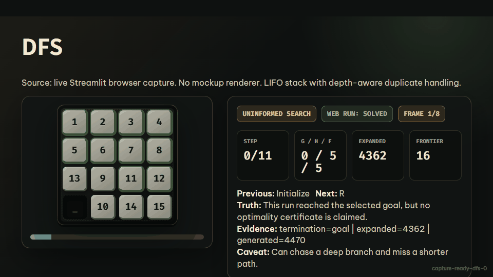</p>

- **Learning goal:** See how depth-first commitment differs from optimal state-space search.
- **Mechanism:** LIFO stack with depth-aware duplicate handling.
- **Trace evidence:** expanded nodes, depth limit and legal trajectory when present.
- **Guarantee:** No shortest-path guarantee in this app setting.
- **Caveat:** Can chase a deep branch and miss a shorter path.
- **Phù hợp với 15-puzzle chuẩn:** Không dùng làm solver chuẩn: có thể tìm được một path hợp lệ nhưng không bảo đảm ngắn nhất và dễ đi sâu vào nhánh kém.
- **Kết luận chạy / độ phù hợp:** **CHẠY ĐƯỢC, DEMO TỚI GOAL NHƯNG KHÔNG CÓ CHỨNG CHỈ TỐI ƯU — Không dùng run này để claim shortest path hoặc solver chuẩn tối ưu.**
- **Source:** `live_streamlit_browser_capture` via `agent-browser screenshot`.
- **web_run_status:** `solved_not_optimal` - reached goal without an optimality certificate.
- **Result message:** Solution found
- **Manifest:** termination `goal`, profile `algorithm`, frames `8`, verified `2026-06-29`.

### UCS

<p>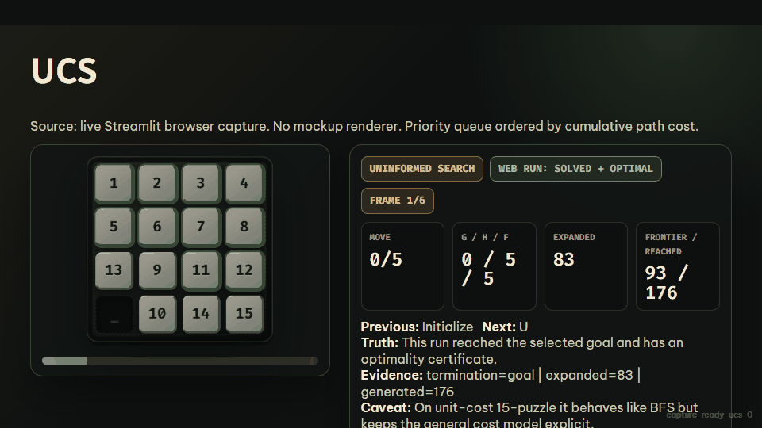</p>

- **Learning goal:** Connect path cost g(n) to optimal search.
- **Mechanism:** Priority queue ordered by cumulative path cost.
- **Trace evidence:** g(n), frontier, reached and cost certificate.
- **Guarantee:** Complete and optimal for non-negative costs.
- **Caveat:** On unit-cost 15-puzzle it behaves like BFS but keeps the general cost model explicit.
- **Phù hợp với 15-puzzle chuẩn:** Solver chuẩn khi chi phí bước không âm. Với 15-puzzle unit cost, UCS gần tương đương BFS nhưng giữ rõ mô hình path cost g(n).
- **Kết luận chạy / độ phù hợp:** **PHÙ HỢP LÀM SOLVER CHUẨN — Demo thật đã tới goal bằng legal path và có chứng chỉ tối ưu cho cấu hình đã chạy.**
- **Source:** `live_streamlit_browser_capture` via `agent-browser screenshot`.
- **web_run_status:** `solved_optimal` - reached goal with an optimality certificate.
- **Result message:** Solution found
- **Manifest:** termination `goal`, profile `algorithm`, frames `6`, verified `2026-06-29`.

### IDS

<p>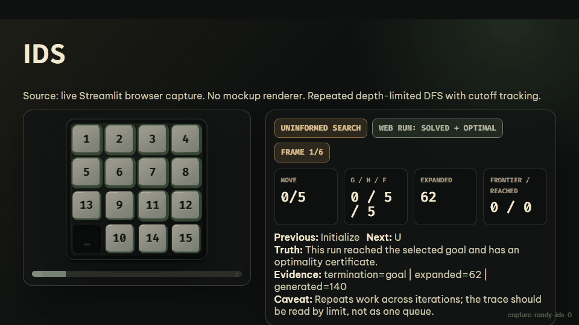</p>

- **Learning goal:** Trade BFS optimality for DFS-like memory by increasing the depth limit.
- **Mechanism:** Repeated depth-limited DFS with cutoff tracking.
- **Trace evidence:** depth limit, cutoff/exhausted reason and legal path.
- **Guarantee:** Complete and optimal for unit step cost if the limit reaches the solution depth.
- **Caveat:** Repeats work across iterations; the trace should be read by limit, not as one queue.
- **Phù hợp với 15-puzzle chuẩn:** Solver chuẩn cho unit-cost khi depth limit đủ lớn: tiết kiệm bộ nhớ hơn BFS nhưng lặp lại nhiều lần qua các giới hạn độ sâu.
- **Kết luận chạy / độ phù hợp:** **PHÙ HỢP LÀM SOLVER CHUẨN — Demo thật đã tới goal bằng legal path và có chứng chỉ tối ưu cho cấu hình đã chạy.**
- **Source:** `live_streamlit_browser_capture` via `agent-browser screenshot`.
- **web_run_status:** `solved_optimal` - reached goal with an optimality certificate.
- **Result message:** Found at depth 5, limit=5
- **Manifest:** termination `goal`, profile `algorithm`, frames `6`, verified `2026-06-29`.

## Informed Search

**Mục tiêu:** Add h(n), then combine with g(n) for optimal informed search.

### Greedy Best-First

<p>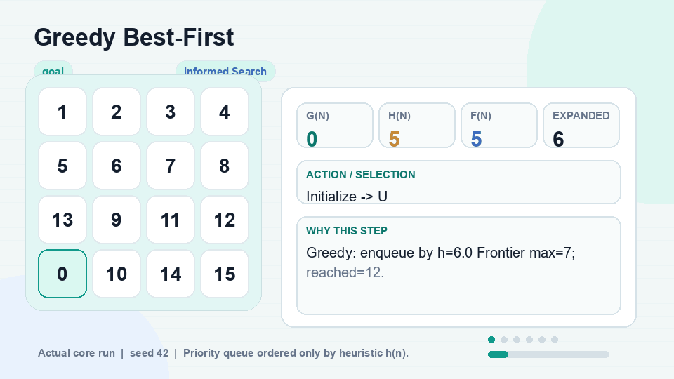</p>

- **Learning goal:** Show why h(n) alone is fast but not a certificate.
- **Mechanism:** Priority queue ordered only by heuristic h(n).
- **Trace evidence:** selected h(n), frontier and whether the final path reaches goal.
- **Guarantee:** No optimality guarantee.
- **Caveat:** May find a longer path or get misled by a locally attractive state.
- **Phù hợp với 15-puzzle chuẩn:** Không dùng để chứng minh tối ưu: h(n) giúp chạy nhanh hơn nhưng bỏ qua g(n), nên path có thể dài hơn A*.
- **Kết luận chạy / độ phù hợp:** **CHẠY ĐƯỢC, DEMO TỚI GOAL NHƯNG KHÔNG CÓ CHỨNG CHỈ TỐI ƯU — Không dùng run này để claim shortest path hoặc solver chuẩn tối ưu.**
- **Source:** `live_streamlit_browser_capture` via `agent-browser screenshot`.
- **web_run_status:** `solved_not_optimal` - reached goal without an optimality certificate.
- **Result message:** Solution found
- **Manifest:** termination `goal`, profile `algorithm`, frames `6`, verified `2026-06-29`.

### A*

<p>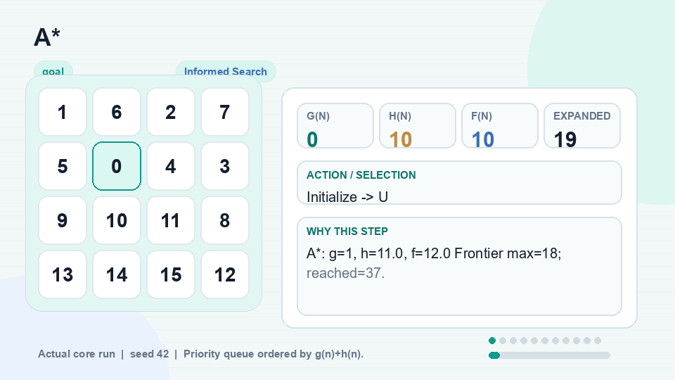</p>

- **Learning goal:** Read f(n)=g(n)+h(n) and the Manhattan optimality condition.
- **Mechanism:** Priority queue ordered by g(n)+h(n).
- **Trace evidence:** g/h/f, expanded/generated/frontier, legal path and optimality flag.
- **Guarantee:** Optimal with admissible and consistent heuristic when resources do not stop the run.
- **Caveat:** The certificate is valid only for the selected goal and heuristic contract.
- **Phù hợp với 15-puzzle chuẩn:** Solver chuẩn chính của app: với Manhattan Distance admissible/consistent và unit step cost, có thể bật optimality_proven khi tới goal.
- **Kết luận chạy / độ phù hợp:** **PHÙ HỢP LÀM SOLVER CHUẨN — Demo thật đã tới goal bằng legal path và có chứng chỉ tối ưu cho cấu hình đã chạy.**
- **Source:** `live_streamlit_browser_capture` via `agent-browser screenshot`.
- **web_run_status:** `solved_optimal` - reached goal with an optimality certificate.
- **Result message:** Solution found
- **Manifest:** termination `goal`, profile `algorithm`, frames `11`, verified `2026-06-29`.

### IDA*

<p>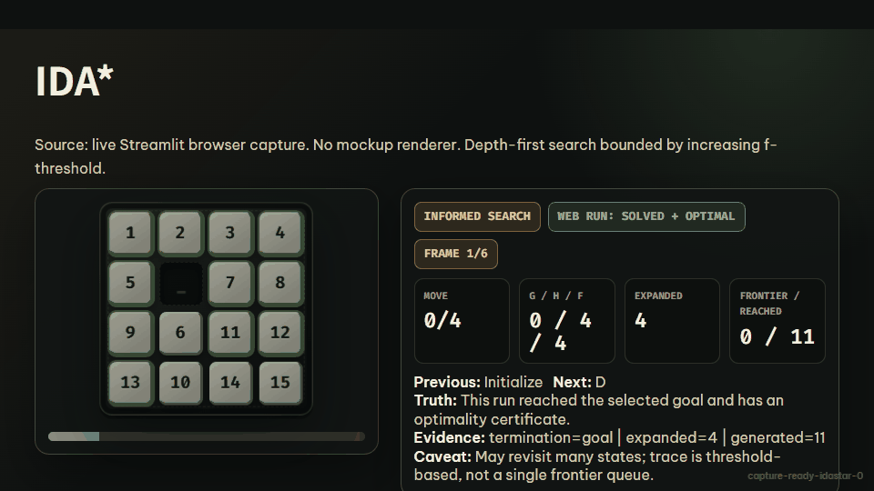</p>

- **Learning goal:** Combine A* evaluation with memory-bounded iterative thresholds.
- **Mechanism:** Depth-first search bounded by increasing f-threshold.
- **Trace evidence:** threshold, reached metric, legal path and optimality flag.
- **Guarantee:** Optimal with admissible heuristic and sufficient threshold iterations.
- **Caveat:** May revisit many states; trace is threshold-based, not a single frontier queue.
- **Phù hợp với 15-puzzle chuẩn:** Solver chuẩn memory-bounded: hợp với 15-puzzle sâu hơn A* về bộ nhớ, đổi lại có thể revisit nhiều state theo threshold.
- **Kết luận chạy / độ phù hợp:** **PHÙ HỢP LÀM SOLVER CHUẨN — Demo thật đã tới goal bằng legal path và có chứng chỉ tối ưu cho cấu hình đã chạy.**
- **Source:** `live_streamlit_browser_capture` via `agent-browser screenshot`.
- **web_run_status:** `solved_optimal` - reached goal with an optimality certificate.
- **Result message:** Found with threshold=4
- **Manifest:** termination `goal`, profile `algorithm`, frames `6`, verified `2026-06-29`.

## Local Search

**Mục tiêu:** Show candidate-level choices without treating the run as guaranteed path search.

### Simple Hill Climbing

<p>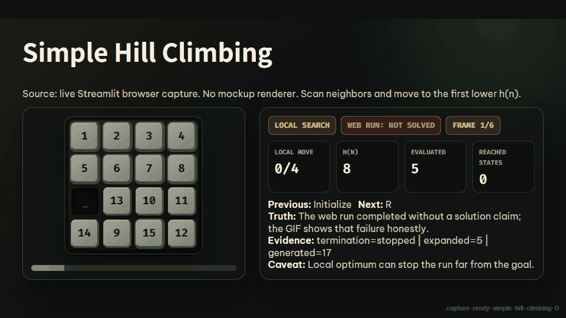</p>

- **Learning goal:** Watch the first improving candidate win or the search stop.
- **Mechanism:** Scan neighbors and move to the first lower h(n).
- **Trace evidence:** candidate h, selected action and stop reason.
- **Guarantee:** No completeness or optimality guarantee.
- **Caveat:** Local optimum can stop the run far from the goal.
- **Phù hợp với 15-puzzle chuẩn:** Không ổn làm solver chuẩn: chỉ đi theo cải thiện cục bộ và có thể dừng ở local optimum dù goal chưa đạt. GIF ghi trung thực rằng demo không tạo solution claim.
- **Kết luận chạy / độ phù hợp:** **CHẠY ĐƯỢC NHƯNG DEMO KHÔNG TỚI GOAL — Run dừng có kiểm soát (`termination=stopped`), không phải crash; trajectory/evidence không được gọi là lời giải.**
- **Source:** `live_streamlit_browser_capture` via `agent-browser screenshot`.
- **web_run_status:** `not_solved_in_demo` - web demo completed without a solution claim.
- **Result message:** Stuck at local optimum h=4.0
- **Manifest:** termination `stopped`, profile `algorithm`, frames `6`, verified `2026-06-29`.

### Steepest-Ascent Hill Climbing

<p>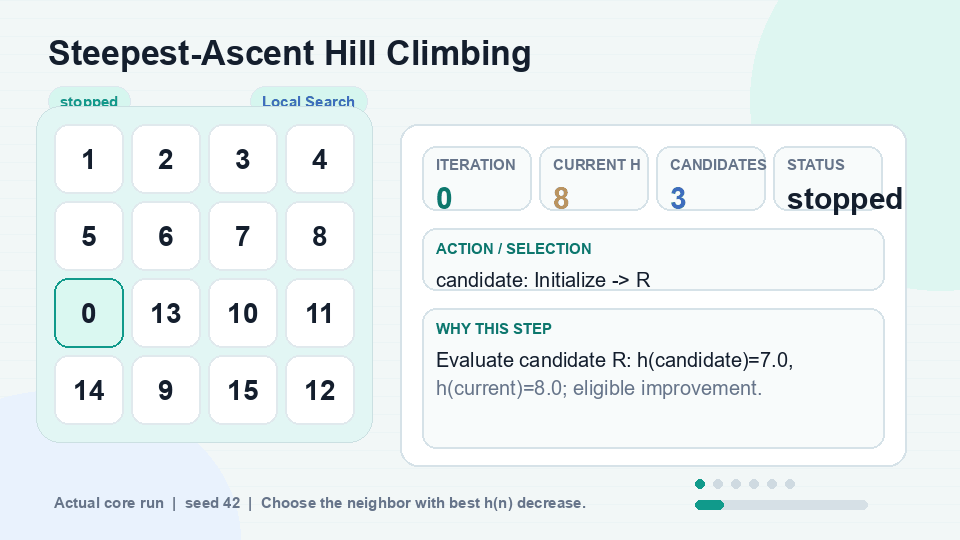</p>

- **Learning goal:** Compare all local neighbors before moving.
- **Mechanism:** Choose the neighbor with best h(n) decrease.
- **Trace evidence:** evaluated candidates, best candidate and reject/accept reason.
- **Guarantee:** No completeness or optimality guarantee.
- **Caveat:** Still local; evaluating every neighbor does not solve plateaus.
- **Phù hợp với 15-puzzle chuẩn:** Không ổn làm solver chuẩn: xét hết neighbor cục bộ tốt hơn Simple HC nhưng vẫn kẹt plateau/local optimum. GIF ghi trung thực rằng demo không tạo solution claim.
- **Kết luận chạy / độ phù hợp:** **CHẠY ĐƯỢC NHƯNG DEMO KHÔNG TỚI GOAL — Run dừng có kiểm soát (`termination=stopped`), không phải crash; trajectory/evidence không được gọi là lời giải.**
- **Source:** `live_streamlit_browser_capture` via `agent-browser screenshot`.
- **web_run_status:** `not_solved_in_demo` - web demo completed without a solution claim.
- **Result message:** Stuck at local optimum h=4.0
- **Manifest:** termination `stopped`, profile `algorithm`, frames `6`, verified `2026-06-29`.

### Stochastic Hill Climbing

<p>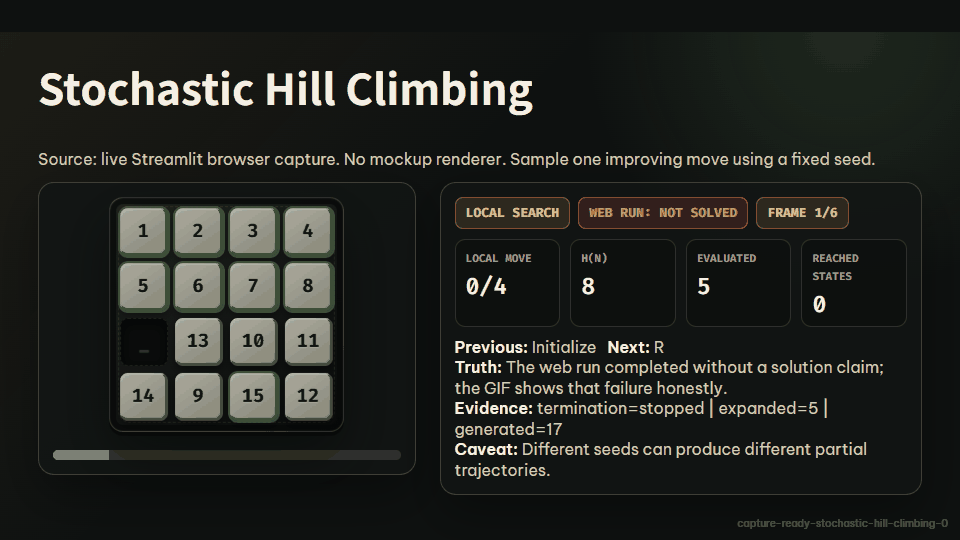</p>

- **Learning goal:** See randomness among improving candidates.
- **Mechanism:** Sample one improving move using a fixed seed.
- **Trace evidence:** candidate pool, chosen action, seed and legal trajectory.
- **Guarantee:** No deterministic optimality guarantee.
- **Caveat:** Different seeds can produce different partial trajectories.
- **Phù hợp với 15-puzzle chuẩn:** Không ổn làm solver chuẩn: seed khác có thể cho trajectory khác, không có completeness hay optimality certificate. GIF ghi trung thực rằng demo không tạo solution claim.
- **Kết luận chạy / độ phù hợp:** **CHẠY ĐƯỢC NHƯNG DEMO KHÔNG TỚI GOAL — Run dừng có kiểm soát (`termination=stopped`), không phải crash; trajectory/evidence không được gọi là lời giải.**
- **Source:** `live_streamlit_browser_capture` via `agent-browser screenshot`.
- **web_run_status:** `not_solved_in_demo` - web demo completed without a solution claim.
- **Result message:** Stuck at local optimum h=4.0
- **Manifest:** termination `stopped`, profile `algorithm`, frames `6`, verified `2026-06-29`.

### Random-Restart Hill Climbing

<p>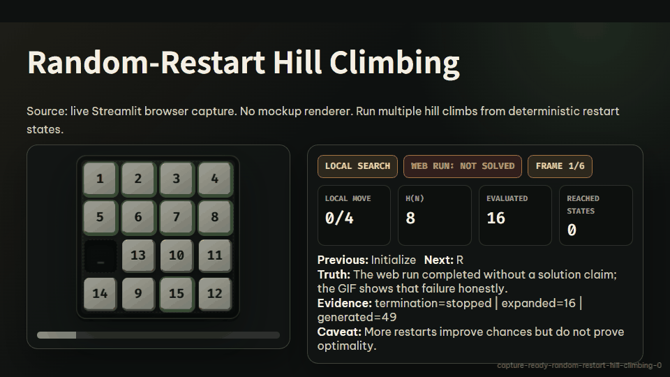</p>

- **Learning goal:** Use restarts to escape one bad local basin.
- **Mechanism:** Run multiple hill climbs from deterministic restart states.
- **Trace evidence:** restart index, best h(n) and selected trajectory.
- **Guarantee:** Still not a complete 15-puzzle solver here.
- **Caveat:** More restarts improve chances but do not prove optimality.
- **Phù hợp với 15-puzzle chuẩn:** Không ổn làm solver chuẩn: restart tăng cơ hội thoát basin xấu nhưng vẫn không chứng minh được shortest path. GIF ghi trung thực rằng demo không tạo solution claim.
- **Kết luận chạy / độ phù hợp:** **CHẠY ĐƯỢC NHƯNG DEMO KHÔNG TỚI GOAL — Run dừng có kiểm soát (`termination=stopped`), không phải crash; trajectory/evidence không được gọi là lời giải.**
- **Source:** `live_streamlit_browser_capture` via `agent-browser screenshot`.
- **web_run_status:** `not_solved_in_demo` - web demo completed without a solution claim.
- **Result message:** Best h=4.0 after 3 restarts
- **Manifest:** termination `stopped`, profile `algorithm`, frames `6`, verified `2026-06-29`.

### Local Beam Search

<p>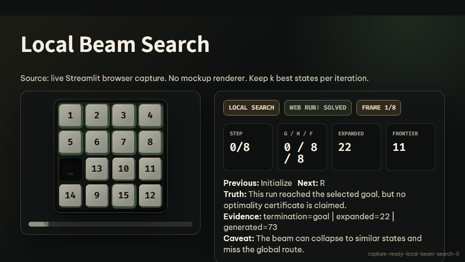</p>

- **Learning goal:** Track several local candidates at once.
- **Mechanism:** Keep k best states per iteration.
- **Trace evidence:** beam width, candidate scores and selected beam states.
- **Guarantee:** No optimality guarantee.
- **Caveat:** The beam can collapse to similar states and miss the global route.
- **Phù hợp với 15-puzzle chuẩn:** Không ổn làm solver chuẩn: giữ nhiều candidate giúp minh họa tìm kiếm cục bộ, nhưng beam nhỏ có thể bỏ mất route tốt.
- **Kết luận chạy / độ phù hợp:** **CHẠY ĐƯỢC, DEMO TỚI GOAL NHƯNG KHÔNG CÓ CHỨNG CHỈ TỐI ƯU — Không dùng run này để claim shortest path hoặc solver chuẩn tối ưu.**
- **Source:** `live_streamlit_browser_capture` via `agent-browser screenshot`.
- **web_run_status:** `solved_not_optimal` - reached goal without an optimality certificate.
- **Result message:** Goal reached
- **Manifest:** termination `goal`, profile `algorithm`, frames `8`, verified `2026-06-29`.

### Simulated Annealing

<p>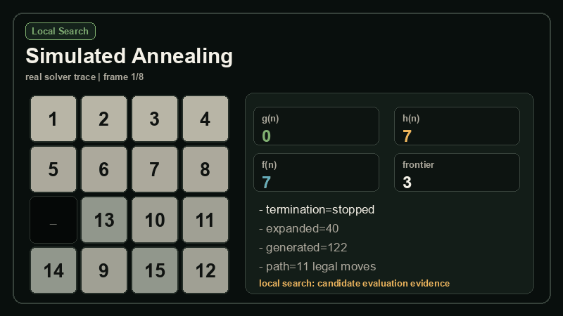</p>

- **Learning goal:** Understand probabilistic acceptance of worse moves.
- **Mechanism:** Temperature-controlled accept/reject over neighbors.
- **Trace evidence:** temperature, probability, accepted flag and legal trajectory.
- **Guarantee:** No certificate of reaching or optimizing the goal.
- **Caveat:** A legal trajectory is not automatically a solution.
- **Phù hợp với 15-puzzle chuẩn:** Không ổn làm solver chuẩn: có thể nhận bước xấu để thoát local optimum, nhưng legal trajectory không đồng nghĩa solved hoặc optimal. GIF ghi trung thực rằng demo không tạo solution claim.
- **Kết luận chạy / độ phù hợp:** **CHẠY ĐƯỢC NHƯNG DEMO KHÔNG TỚI GOAL — Run dừng có kiểm soát (`termination=stopped`), không phải crash; trajectory/evidence không được gọi là lời giải.**
- **Source:** `live_streamlit_browser_capture` via `agent-browser screenshot`.
- **web_run_status:** `not_solved_in_demo` - web demo completed without a solution claim.
- **Result message:** Best h=5.0, temp=98.0684
- **Manifest:** termination `stopped`, profile `algorithm`, frames `8`, verified `2026-06-29`.

## Complex Environments

**Mục tiêu:** Model conditional, conformant and contingent planning over explicit belief states.

### AND-OR Search

<p>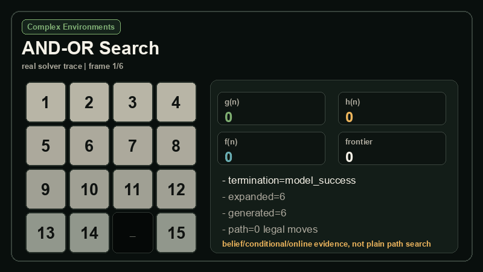</p>

- **Learning goal:** Read a conditional plan under possible outcome deflections.
- **Mechanism:** OR chooses action; AND requires subplans for supported outcomes.
- **Trace evidence:** conditional branches, depth limit and deflection support mode.
- **Guarantee:** Returns a policy-like conditional plan, not a linear shortest path.
- **Caveat:** The support switch is not probability weighting.
- **Phù hợp với 15-puzzle chuẩn:** Không phải solver tuyến tính của 15-puzzle deterministic: dùng để minh họa conditional plan khi môi trường có outcome lệch. GIF là model evidence, không phải path tới goal.
- **Kết luận chạy / độ phù hợp:** **CHẠY ĐƯỢC VÀ TRẢ CONDITIONAL PLAN — Output đúng là kế hoạch có nhánh, không phải một linear path tới goal của 15-puzzle deterministic.**
- **Source:** `live_streamlit_browser_capture` via `agent-browser screenshot`.
- **web_run_status:** `ran_model_not_goal_path` - ran successfully as model evidence, not a solved path.
- **Result message:** Conditional plan found (depth limit=2). AND-OR requires every supported outcome to succeed. Deflection support=intended outcome only; nondet_prob>0 adds all legal deflections, not probability-weighted branches. OR: choose action R (h=1.0)
- **Manifest:** termination `model_success`, profile `algorithm`, frames `6`, verified `2026-06-29`.

### Searching with no observation

<p>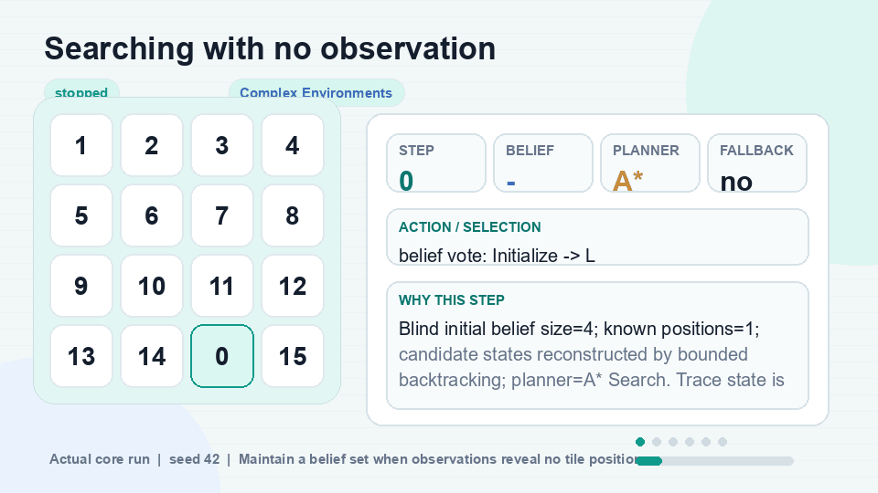</p>

- **Learning goal:** Find one conformant action sequence without reading the hidden state.
- **Mechanism:** Graph-search finite belief states using Predict(B,a), with illegal actions defined as no-op.
- **Trace evidence:** belief frontier/reached, duplicate rejection, action sequence and goal coverage.
- **Guarantee:** Success means every represented initial state reaches the goal under one sequence.
- **Caveat:** The finite reconstructed belief is an approximation, and bounded failure is not a global impossibility proof.
- **Phù hợp với 15-puzzle chuẩn:** Không phải solver chuẩn full-observation: conformant sequence phải đúng cho mọi state trong belief hữu hạn và không được đọc hidden state. GIF là model evidence, không phải path tới goal.
- **Kết luận chạy / độ phù hợp:** **CHẠY ĐƯỢC Ở CHẾ ĐỘ MÔ HÌNH/EVIDENCE — Không sinh legal solution path tới goal; mục này dùng để minh họa khái niệm, không phải solver 15-puzzle chuẩn.**
- **Source:** `live_streamlit_browser_capture` via `agent-browser screenshot`.
- **web_run_status:** `ran_model_not_goal_path` - ran successfully as model evidence, not a solved path.
- **Result message:** Conformant belief-state search found one fixed action sequence that sends every represented state to the goal.
- **Manifest:** termination `model_success`, profile `algorithm`, frames `8`, verified `2026-06-29`.

### Searching for partially observable problems

<p>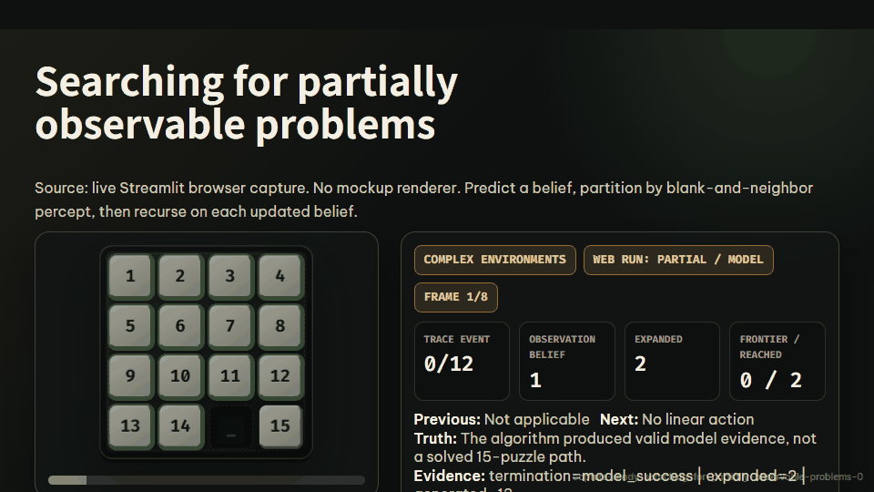</p>

- **Learning goal:** Build a contingent policy that covers every possible local observation.
- **Mechanism:** Predict a belief, partition by blank-and-neighbor percept, then recurse on each updated belief.
- **Trace evidence:** predicted belief, observation partitions, branch coverage and policy depth.
- **Guarantee:** Success requires a subpolicy for every represented observation branch.
- **Caveat:** The sensor and finite belief approximation are explicit; hidden state never builds the policy.
- **Phù hợp với 15-puzzle chuẩn:** Không phải linear solver chuẩn: output là contingent policy phân nhánh theo observation của blank và tile kề. GIF là model evidence, không phải path tới goal.
- **Kết luận chạy / độ phù hợp:** **CHẠY ĐƯỢC Ở CHẾ ĐỘ MÔ HÌNH/EVIDENCE — Không sinh legal solution path tới goal; mục này dùng để minh họa khái niệm, không phải solver 15-puzzle chuẩn.**
- **Source:** `live_streamlit_browser_capture` via `agent-browser screenshot`.
- **web_run_status:** `ran_model_not_goal_path` - ran successfully as model evidence, not a solved path.
- **Result message:** Contingent belief-state AND-OR search found a policy covering every represented observation branch.
- **Manifest:** termination `model_success`, profile `algorithm`, frames `8`, verified `2026-06-29`.

## CSP

**Mục tiêu:** Reframe puzzle planning as variables, domains and constraints.

### Backtracking

<p>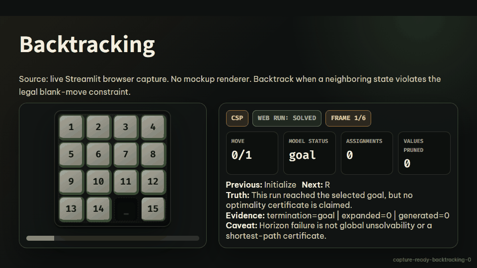</p>

- **Learning goal:** Assign an exact-horizon state chain chronologically.
- **Mechanism:** Backtrack when a neighboring state violates the legal blank-move constraint.
- **Trace evidence:** assignments, checks, backtracks and verified path when found.
- **Guarantee:** Sound within the represented horizon and resource bounds.
- **Caveat:** Horizon failure is not global unsolvability or a shortest-path certificate.
- **Phù hợp với 15-puzzle chuẩn:** CSP assignment search theo exact horizon: chỉ replay verified legal chain; không claim shortest path hoặc unsolvable toàn cục.
- **Kết luận chạy / độ phù hợp:** **CHẠY ĐƯỢC, DEMO TỚI GOAL NHƯNG KHÔNG CÓ CHỨNG CHỈ TỐI ƯU — Không dùng run này để claim shortest path hoặc solver chuẩn tối ưu.**
- **Source:** `live_streamlit_browser_capture` via `agent-browser screenshot`.
- **web_run_status:** `solved_not_optimal` - reached goal without an optimality certificate.
- **Result message:** Backtracking found an exact-horizon CSP assignment for T=1. checks=0, backtracks=0, values_pruned=0.
- **Manifest:** termination `goal`, profile `algorithm`, frames `6`, verified `2026-06-29`.

### Backtracking + Forward Checking

<p>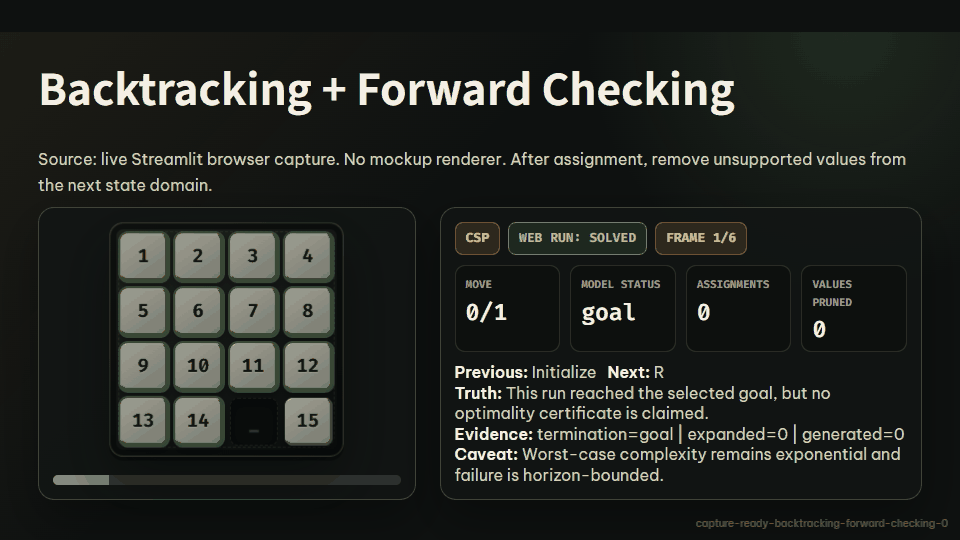</p>

- **Learning goal:** Compare early domain pruning with plain backtracking.
- **Mechanism:** After assignment, remove unsupported values from the next state domain.
- **Trace evidence:** assignments, values pruned, domain wipe-out and backtracks.
- **Guarantee:** Uses the same ordering as Backtracking for a fair empirical comparison.
- **Caveat:** Worst-case complexity remains exponential and failure is horizon-bounded.
- **Phù hợp với 15-puzzle chuẩn:** CSP assignment search có domain pruning; dùng cùng ordering với Backtracking để so sánh, nhưng worst case vẫn exponential.
- **Kết luận chạy / độ phù hợp:** **CHẠY ĐƯỢC, DEMO TỚI GOAL NHƯNG KHÔNG CÓ CHỨNG CHỈ TỐI ƯU — Không dùng run này để claim shortest path hoặc solver chuẩn tối ưu.**
- **Source:** `live_streamlit_browser_capture` via `agent-browser screenshot`.
- **web_run_status:** `solved_not_optimal` - reached goal without an optimality certificate.
- **Result message:** Backtracking + Forward Checking found an exact-horizon CSP assignment for T=1. checks=0, backtracks=0, values_pruned=0.
- **Manifest:** termination `goal`, profile `algorithm`, frames `6`, verified `2026-06-29`.

### AC-3

<p>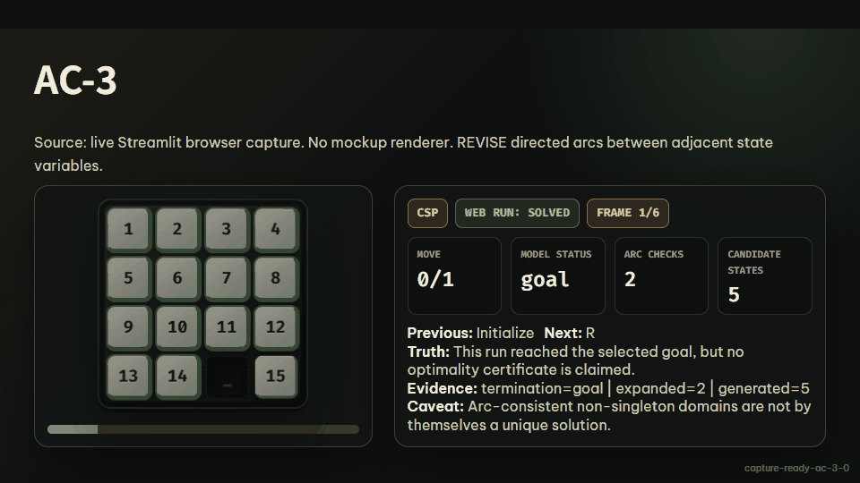</p>

- **Learning goal:** Read arc consistency without confusing propagation with a solved path.
- **Mechanism:** REVISE directed arcs between adjacent state variables.
- **Trace evidence:** arc queue, revisions, values removed and domain sizes.
- **Guarantee:** Sound propagation; replay appears only after extracting an exact legal chain.
- **Caveat:** Arc-consistent non-singleton domains are not by themselves a unique solution.
- **Phù hợp với 15-puzzle chuẩn:** Propagation trên exact-horizon state chain; arc consistency là evidence, chỉ replay khi trích được exact legal chain.
- **Kết luận chạy / độ phù hợp:** **CHẠY ĐƯỢC, DEMO TỚI GOAL NHƯNG KHÔNG CÓ CHỨNG CHỈ TỐI ƯU — Không dùng run này để claim shortest path hoặc solver chuẩn tối ưu.**
- **Source:** `live_streamlit_browser_capture` via `agent-browser screenshot`.
- **web_run_status:** `solved_not_optimal` - reached goal without an optimality certificate.
- **Result message:** AC-3 State-Chain CSP completed: revisions=0, values_removed=0, arc_checks=2. Arc-consistent domains contain an extracted verified goal path.
- **Manifest:** termination `goal`, profile `algorithm`, frames `6`, verified `2026-06-29`.

### Min-Conflicts

<p>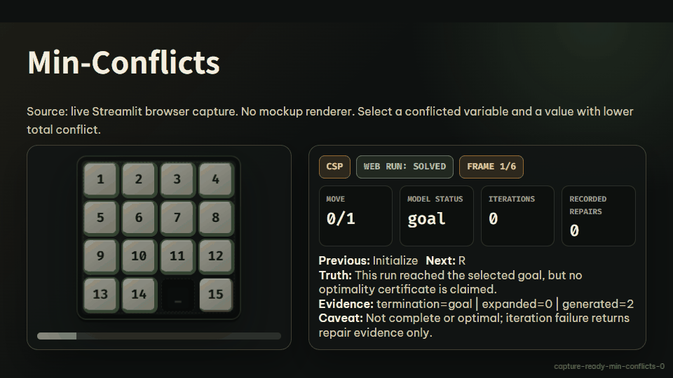</p>

- **Learning goal:** Repair a complete state-chain assignment by reducing violated transitions.
- **Mechanism:** Select a conflicted variable and a value with lower total conflict.
- **Trace evidence:** iteration, conflicted variable, conflict count and fixed seed.
- **Guarantee:** A zero-conflict verified chain is replayable.
- **Caveat:** Not complete or optimal; iteration failure returns repair evidence only.
- **Phù hợp với 15-puzzle chuẩn:** Local repair trên complete state-chain assignment; chỉ gọi thành công khi conflict bằng 0 và mọi transition là legal blank move.
- **Kết luận chạy / độ phù hợp:** **CHẠY ĐƯỢC, DEMO TỚI GOAL NHƯNG KHÔNG CÓ CHỨNG CHỈ TỐI ƯU — Không dùng run này để claim shortest path hoặc solver chuẩn tối ưu.**
- **Source:** `live_streamlit_browser_capture` via `agent-browser screenshot`.
- **web_run_status:** `solved_not_optimal` - reached goal without an optimality certificate.
- **Result message:** Min-Conflicts found a zero-conflict chain at iteration 0.
- **Manifest:** termination `goal`, profile `algorithm`, frames `6`, verified `2026-06-29`.

## AI-vs-AI Tournament

**Mục tiêu:** Decision / Policy Lab: scored benchmark, policy comparison, robustness game variant and chance outcome lab without pretending standard 15-puzzle has a natural opponent.

Play tách Group 6 thành ba mode: Policy Comparison dùng hai board độc lập, Robustness Game Variant dùng một board chung MAX/MIN nhân tạo, Chance Outcome Lab dùng Expectimax với probability model và seed. Không mode nào được gọi là solver chuẩn hay shortest-path certificate.

### AI-vs-AI Tournament

<p></p>

- **Learning goal:** Score two agents against the same A* reference.
- **Mechanism:** Run two solvers and classify verified trajectories.
- **Trace evidence:** points, optimal cost, excess cost and invalid-path penalties.
- **Guarantee:** Fair benchmark when the reference certificate exists.
- **Caveat:** Tournament is not a natural adversarial PEAS model.
- **Phù hợp với 15-puzzle chuẩn:** Không phải thuật toán giải puzzle: là lớp chấm điểm hai solver bằng A* reference và verified trajectory.
- **Kết luận chạy / độ phù hợp:** **CHẠY ĐƯỢC Ở CHẾ ĐỘ CHẤM ĐIỂM — Đây là benchmark hai agent, không phải một thuật toán sinh solution path riêng.**
- **Source:** `live_streamlit_browser_capture` via `agent-browser screenshot`.
- **web_run_status:** `ran_tournament_model` - scored tournament model, not one solution path.
- **Result message:** Tournament scoring run
- **Manifest:** termination `tournament_scored`, profile `algorithm`, frames `6`, verified `2026-06-29`.

### Minimax

<p>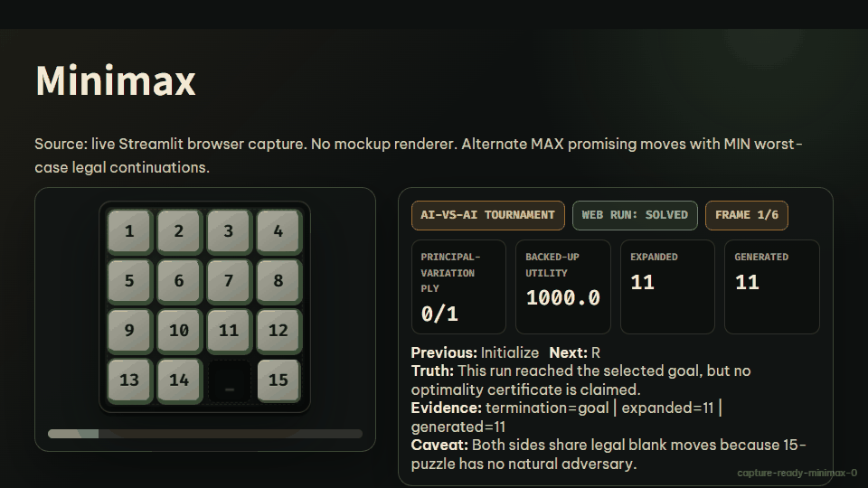</p>

- **Learning goal:** Interpret MIN as worst-case robustness, not a real puzzle opponent.
- **Mechanism:** Alternate MAX promising moves with MIN worst-case legal continuations.
- **Trace evidence:** MAX/MIN nodes, utility and selected root action.
- **Guarantee:** Depth-limited worst-case decision rule.
- **Caveat:** Both sides share legal blank moves because 15-puzzle has no natural adversary.
- **Phù hợp với 15-puzzle chuẩn:** Không phải solver tự nhiên của 15-puzzle: MIN là nhánh worst-case robustness, không phải đối thủ thật. GIF là root decision / policy evidence; nếu variation tới goal thì đó vẫn không phải solver certificate.
- **Kết luận chạy / độ phù hợp:** **DECISION / POLICY EVIDENCE — Demo may move through legal puzzle states, but the output is root decision / policy evidence, not a shortest solver certificate.**
- **Source:** `live_streamlit_browser_capture` via `agent-browser screenshot`.
- **web_run_status:** `decision_policy_demo` - root decision / policy evidence, not a shortest solver certificate.
- **Result message:** Minimax (depth=2) Completed depth 2 Best utility: 1000.0 MAX selects the most promising legal move. MIN branch models worst-case legal continuations, not a real opponent. Standard 15-puzzle has no natural adversary; this is robustness analy
- **Manifest:** termination `goal`, profile `algorithm`, frames `6`, verified `2026-06-29`.

### Alpha-Beta Pruning

<p>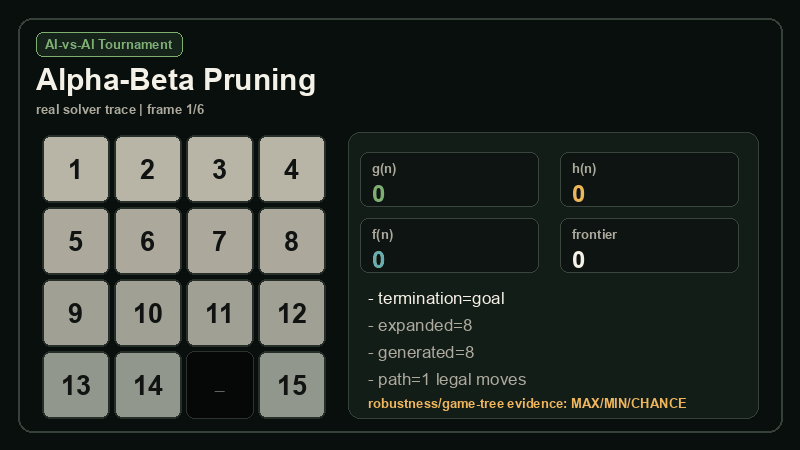</p>

- **Learning goal:** Learn branch-and-bound pruning over the same worst-case tree.
- **Mechanism:** Prune branches that cannot change the minimax root value.
- **Trace evidence:** alpha, beta, pruned branches and root utility.
- **Guarantee:** Same root value as full Minimax for the searched tree.
- **Caveat:** Pruning saves nodes; it does not turn the puzzle into a real two-player game.
- **Phù hợp với 15-puzzle chuẩn:** Không phải solver tự nhiên của 15-puzzle: chỉ prune cây Minimax worst-case cùng root value, không đổi puzzle thành game hai người. GIF là root decision / policy evidence; nếu variation tới goal thì đó vẫn không phải solver certificate.
- **Kết luận chạy / độ phù hợp:** **DECISION / POLICY EVIDENCE — Demo may move through legal puzzle states, but the output is root decision / policy evidence, not a shortest solver certificate.**
- **Source:** `live_streamlit_browser_capture` via `agent-browser screenshot`.
- **web_run_status:** `decision_policy_demo` - root decision / policy evidence, not a shortest solver certificate.
- **Result message:** Alpha-Beta Pruning (depth=2) Completed depth 2 Best utility: 1000.0 Nodes expanded: 8 Cutoff events: 1 MIN branch models worst-case legal continuations, not a real opponent. With identical ordering, no timeout, and a completed depth, Alpha-
- **Manifest:** termination `goal`, profile `algorithm`, frames `6`, verified `2026-06-29`.

### Expectimax

<p>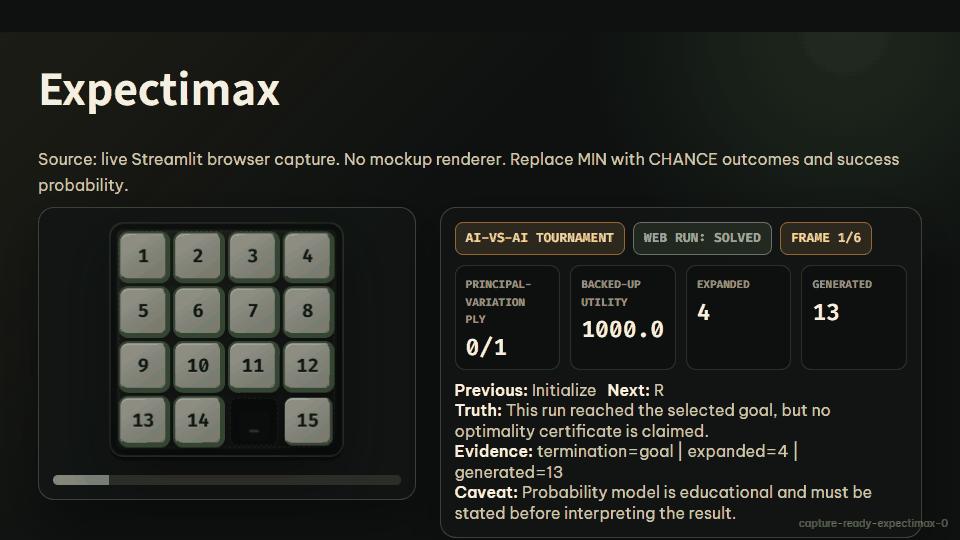</p>

- **Learning goal:** Compare expected value against worst-case reasoning.
- **Mechanism:** Replace MIN with CHANCE outcomes and success probability.
- **Trace evidence:** CHANCE nodes, probabilities and expected utility.
- **Guarantee:** Depth-limited expected-value policy under the chosen probability model.
- **Caveat:** Probability model is educational and must be stated before interpreting the result.
- **Phù hợp với 15-puzzle chuẩn:** Không phải solver chuẩn: dùng CHANCE/probability model để so expected value, xác suất là mô hình giáo dục. GIF là root decision / policy evidence; nếu variation tới goal thì đó vẫn không phải solver certificate.
- **Kết luận chạy / độ phù hợp:** **DECISION / POLICY EVIDENCE — Demo may move through legal puzzle states, but the output is root decision / policy evidence, not a shortest solver certificate.**
- **Source:** `live_streamlit_browser_capture` via `agent-browser screenshot`.
- **web_run_status:** `decision_policy_demo` - root decision / policy evidence, not a shortest solver certificate.
- **Result message:** Expectimax (depth=2, success_prob=0.75) Completed depth 2 Expected utility from start: 749.5 Nodes expanded: 4  Comparison with Minimax:   Minimax: evaluates WORST-CASE legal continuations   Expectimax: computes EXPECTED outcome with CHANCE
- **Manifest:** termination `goal`, profile `algorithm`, frames `6`, verified `2026-06-29`.

## Tái tạo

```bash
python scripts/generate-readme-gifs.py --featured --profile all --theme dark
python scripts/generate-readme-gifs.py --all --profile algorithm --theme dark
python scripts/generate-readme-gifs.py --check --check-readability
```
