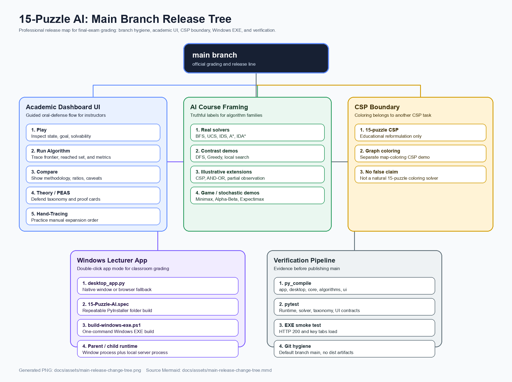

# Master Branch Release Tree

This document records the final-exam release shape after consolidating the project on the single `master` release branch.

## Branch Policy

- `master` is the official grading and release branch.
- Feature branches are temporary implementation lines and should not remain the GitHub default branch.
- The remote default branch must report `HEAD branch: master` in `git remote show origin`.
- Generated build folders such as `dist/` and `build/` stay out of Git.

## Release Shape

- Academic dashboard: the Streamlit UI is organized around the grading path: Play, Run Algorithm, Compare, Theory/PEAS, and Hand-Tracing.
- AI framing: algorithms are labeled as real solvers, contrast demos, illustrative extensions, or stochastic/game demos.
- CSP boundary: graph coloring uses the 12 current wards on the former Thu Duc City territory, with Australia retained as a comparison; it is not presented as a 15-puzzle solver.
- Windows app: `desktop_app.py` supports a lecturer-friendly app window and the PyInstaller build creates `dist/15-Puzzle-AI/15-Puzzle-AI.exe`.
- Verification: Python compile checks, pytest regressions, EXE smoke checks, and Git branch checks are required before publishing.

## Mermaid Source

The source diagram is stored at `docs/assets/main-release-change-tree.mmd` so the PNG can be regenerated when the release shape changes.
