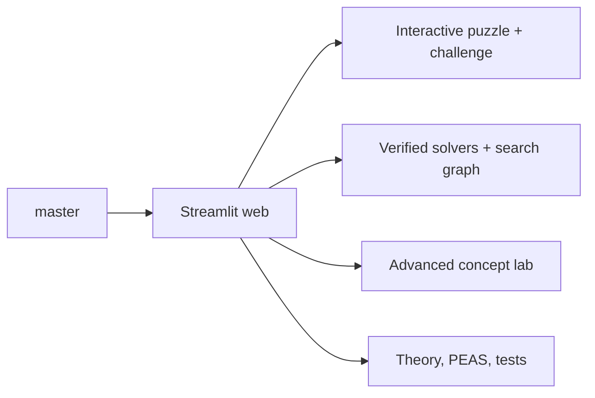

# Master Branch Release Tree

This document records the final-exam release shape after consolidating the project on the single `master` release branch.

## Branch Policy

- `master` is the official grading and release branch.
- Feature branches are temporary implementation lines and should not remain the GitHub default branch.
- The remote default branch must report `HEAD branch: master` in `git remote show origin`.
- Desktop/EXE wrappers are not release artifacts; generated folders stay out of Git.

## Release Shape

- Academic dashboard: the Streamlit UI is organized around the grading path: Play, Run Algorithm, Compare, Theory/PEAS, and Hand-Tracing.
- AI framing: algorithms are labeled as real solvers, contrast demos, illustrative extensions, or AI-vs-AI/game-chance demos.
- Advanced boundary: AI-vs-AI Tournament is a scoring layer over two solver agents with A* reference evidence; CSP/game/chance modes remain educational extensions, not standard solver rankings.
- Web learning lab: manual play, optimality challenge, legal path playback, and bounded parent-linked search evidence share one browser surface.
- Verification: Python compile checks, pytest regressions, Streamlit AppTest, web health, and Git branch checks are required before publishing.

## Mermaid Source

The inline Mermaid diagram is the authoritative release view.
