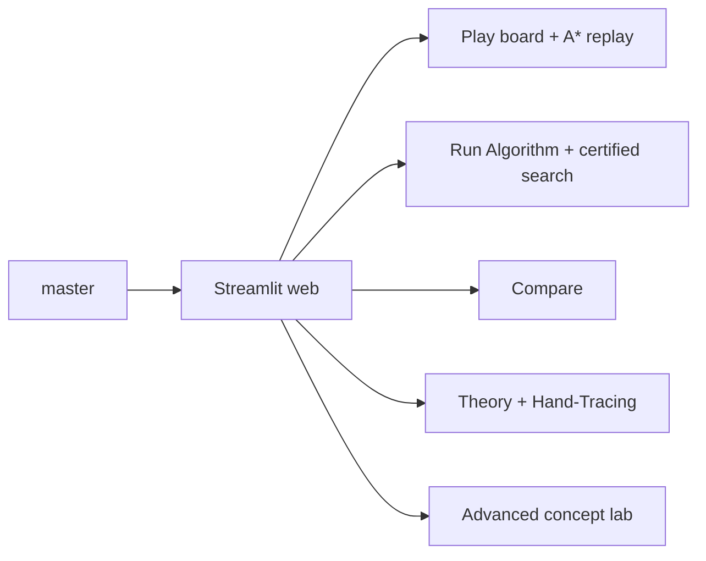

# Cây nhánh và release

Tài liệu này ghi lại hình dạng release cho bài thi sau khi hợp nhất dự án về nhánh chính `master`.

## Chính sách nhánh

- `master` là nhánh release và chấm bài chính thức.
- Feature branch chỉ là nhánh tạm để phát triển, không nên là default branch lâu dài.
- Remote default branch nên trỏ về `master`.
- Generated folders, desktop wrappers và artifact đóng gói không thuộc release source.

## Hình dạng release

| Thành phần | Nội dung |
|---|---|
| Web learning lab | Play, Run Algorithm, Compare, Hand-Tracing, Theory, Advanced. |
| Academic framing | Thuật toán được label là solver chuẩn, demo đối chiếu, extension hoặc tournament/game demo. |
| Evidence | Legal path certificate, goal reached, optimality proven, trace và search tree edge. |
| Advanced boundary | CSP/game/chance/belief-state là concept lab, không xếp chung solver leaderboard. |
| Tournament | Hai solver agent được chấm bằng A* reference và replay đồng bộ. |
| Verification | Compile, pytest, coverage, Streamlit health và kiểm tra tài liệu. |

## Mermaid source

Sơ đồ Mermaid ở trên là release view chính thức cho repo hiện tại.
