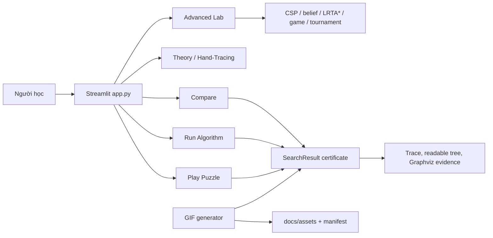

# Kiến Trúc Hệ Thống



## Runtime Layers

| Layer | Modules | Contract |
|---|---|---|
| UI | `app.py`, `ui/*.py` | Render controls, tabs, board/replay, theory, trace, readable tree. |
| Domain | `core/puzzle.py`, `core/heuristics.py`, `core/metrics.py` | State validity, movement, heuristic, `SearchResult` certificate. |
| Solver | `algorithms/*.py` | Public solver signatures stay stable and return `SearchResult`. |
| Dispatch | `core/solver_dispatch.py` | UI params are translated to solver-specific kwargs. |
| Media | `scripts/readme_gif_*.py` | GIFs and manifest are generated from real solver/model evidence. |

## SearchResult Evidence

`SearchResult.__post_init__` recomputes:

- `path_verified`: every action is a legal blank move.
- `goal_reached`: final path state equals `goal_state`.
- `termination_reason`: `goal`, `model_success`, `timeout`, `resource_limit`, `depth_limit`, `exhausted` or `stopped`.
- `optimality_proven`: only true for suitable optimal algorithms with legal path, goal reached and `goal` termination.

This separation avoids false claims such as "legal path means solution" or "success means optimal".

## Search Tree UI

The UI keeps two views:

- Readable tree: larger cards, solution spine, current node, frontier/reached snapshot and legend.
- Graphviz evidence: bounded DOT graph for auditing parent-child edges.

Large search trees are filtered by solution path, expanded neighborhood or first recorded nodes instead of being squeezed into one unreadable image.

## Complex Environment Semantics

- AND-OR returns a conditional plan, not a fake linear solution path.
- No/Partial Observation decisions are based on belief set. Hidden actual state exists for debug evidence only.
- Belief planner trace reports `planner_votes`, `fallback_votes`, `avg_h` and fallback reason when BFS/A*/Stochastic proposal cannot be used.
- LRTA* is an online update demo; its max node control is treated as max online steps.

## Media Pipeline

`scripts/generate-readme-gifs.py` supports:

```bash
python scripts/generate-readme-gifs.py --featured
python scripts/generate-readme-gifs.py --all
python scripts/generate-readme-gifs.py --algorithm "A*"
python scripts/generate-readme-gifs.py --check
```

Each GIF uses fixed start, goal, seed, action order and resource limits. `docs/assets/algorithm-demos/manifest.json` is the audit trail: algorithm, group, function, params, termination, path/certificate flags, frame count and file size.

## Deployment Shape

The app has no database, auth service or secrets. Runtime stack is Python, Streamlit, pandas and Pillow. CI runs compile, GIF manifest check, pytest coverage and Streamlit health smoke on `master`.
