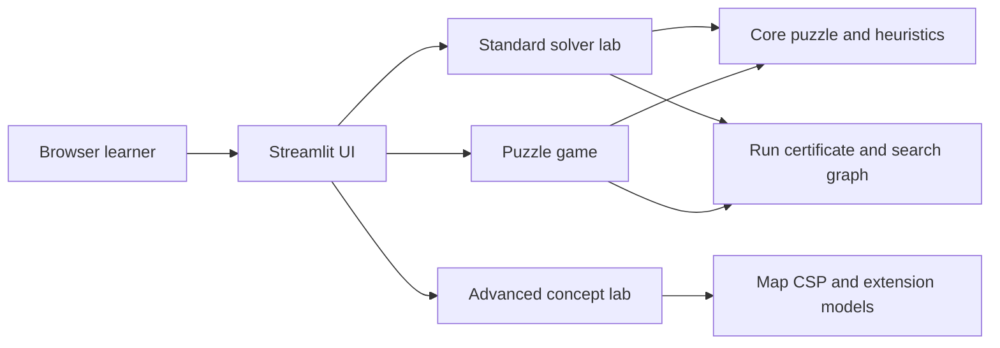

# System Architecture

The standard solver lab accepts only deterministic 15-puzzle algorithms. Extension environments remain isolated in the Advanced concept lab and are not ranked against standard solvers.

Every successful puzzle run contains a legal state/action path certificate. The search visualization draws an edge only when applying its recorded action to the parent produces the child state. Trace capture is bounded for browser responsiveness and reports truncation explicitly.
