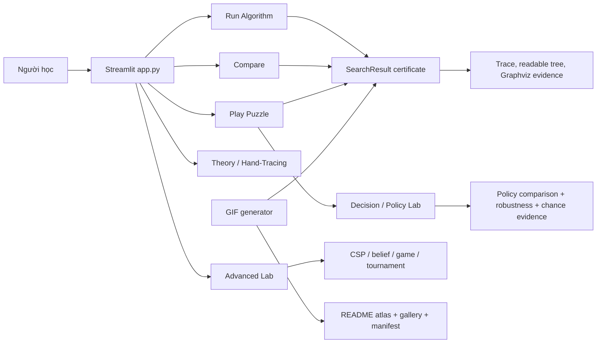

# Kiến Trúc Hệ Thống



## Runtime Layers

| Layer | Modules | Contract |
|---|---|---|
| UI | `app.py`, `ui/*.py` | Render controls, tabs, board/replay, theory, trace, readable tree. |
| Domain | `core/puzzle.py`, `core/heuristics.py`, `core/metrics.py` | State validity, movement, heuristic, `SearchResult` certificate. |
| Solver | `algorithms/*.py` | Public solver signatures stay stable and return `SearchResult`. |
| Dispatch | `core/solver_dispatch.py`, `ui/path_solver_runner.py`, `core/group6_decision_lab.py` | Play/Compare share the 13-algorithm linear runner; Group 6 uses a separate role-frame/fingerprint runner. |
| Media | `scripts/readme_gif_*.py`, `ui/web_gif_capture.py`, `scripts/render_readme_docs.py` | GIFs, README atlas, gallery and manifest are generated from real solver/model evidence captured through the live Streamlit browser route. |

## SearchResult Evidence

`SearchResult.__post_init__` recomputes:

- `path_verified`: every action is a legal blank move.
- `goal_reached`: final path state equals `goal_state`.
- `termination_reason`: `goal`, `model_success`, `timeout`, `resource_limit`, `depth_limit`, `invalid_input`, `invalid_belief`, `unsolvable`, `exhausted` or `stopped`.
- `optimality_proven`: only true for suitable optimal algorithms with legal path, goal reached and `goal` termination.

This separation avoids false claims such as "legal path means solution" or "success means optimal".

## Search Tree UI

The UI keeps two views:

- Readable tree: larger cards, solution spine, current node, frontier/reached snapshot and legend.
- Graphviz evidence: bounded DOT graph for auditing parent-child edges.

Large search trees are filtered by solution path, expanded neighborhood or first recorded nodes instead of being squeezed into one unreadable image.

## Group 6 Decision / Policy Lab

- `ui/group6_policy_comparison.py` owns two independent policy lanes for Minimax, Alpha-Beta and Expectimax.
- `ui/group6_variant_labs.py` owns the single-board Robustness Game Variant and the Expectimax Chance Outcome Lab.
- `ui/group6_decision_lab.py` remains the role-frame decision trace/depth-sweep surface.
- `core/group6_decision_lab.py` invokes the public adversarial solvers without changing their signatures and converts structured trace events into exact role frames.
- `core/group6_variant_labs.py` adds variant state, fingerprints, turn frames and export payloads without image/base64 data.
- Minimax/Alpha-Beta frames alternate MAX and worst-case MIN. Expectimax frames separate intended action from seeded CHANCE outcome.
- Robustness Game Variant is an artificial MAX/MIN environment model on one board; it is not the standard 15-puzzle definition.
- Chance Outcome Lab has no MIN player; it samples stochastic outcomes from an explicit probability model.
- Fingerprints prevent comparison across different Start/Goal/depth/order/probability contracts.
- Space evidence is a proxy from generated/captured nodes and depth; the app does not report fabricated MB.

## Complex Environment Semantics

- AND-OR returns a conditional plan, not a fake linear solution path.
- No Observation is conformant belief-state graph search: one action sequence must work for every represented belief state.
- Partial Observation is contingent belief-state AND-OR search: every observation branch must have a subpolicy.
- Hidden actual state exists only for audit/debug evidence; it is not used to choose actions.

## Media Pipeline

`scripts/generate-readme-gifs.py` supports:

```bash
python scripts/generate-readme-gifs.py --algorithm "A*" --profile hero --theme dark
python scripts/generate-readme-gifs.py --featured --profile all --theme dark
python scripts/generate-readme-gifs.py --all --profile algorithm --theme dark
python scripts/generate-readme-gifs.py --check --check-readability
python scripts/generate-readme-gifs.py --contact-sheet
```

Profiles:

- `hero`: 1280x720, used for the A* image replay.
- `group`: 960x540, used for six group demos.
- `algorithm`: 960x540, used for all 24 algorithm demos.

Capture source:

- Frame source: live Streamlit route `?capture_demo=<slug>&capture_frame=<n>`.
- Capture tool: `agent-browser screenshot`.
- `--theme` is retained as manifest metadata only; visual style comes from the web route.

`docs/assets/algorithm-demos/manifest.json` is the audit trail: algorithm, group, function, params, termination, path/certificate flags, profile, theme, source, capture tool, `web_run_status`, learning goal, guarantee, caveat, frame count and file size.

`scripts/render_readme_docs.py` renders `README.md` and `docs/algorithm-demo-gallery.md` from the same catalog and manifest, so docs stay aligned with generated GIFs.

The Play solver stores the selected algorithm trajectory at index `0`. Manual Next advances exactly one state; Auto only enables the timed fragment, whose first scheduled tick advances one state. Number and image boards read the same replay state. The Play comparison table ranks only runs with a verified legal path that reaches the selected goal.

## Deployment Shape

The app has no database, auth service or secrets. Runtime stack is Python, Streamlit, pandas and Pillow. CI runs compile, GIF manifest check, pytest coverage and Streamlit health smoke on `master`.
