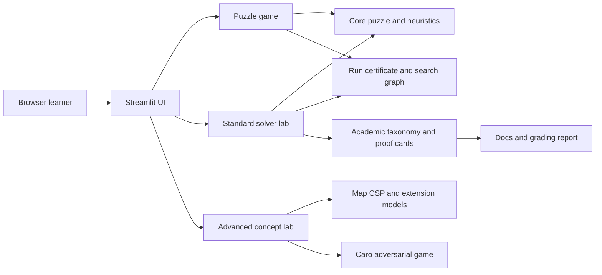

# System Architecture

The standard solver lab accepts only deterministic 15-puzzle algorithms. Extension environments remain isolated in the Advanced concept lab and are not ranked against standard solvers.

Every successful puzzle run contains a legal state/action path certificate. Goal termination and optimality are reported as separate run fields so path legality is not confused with a proof of goal reachability or optimal cost. Extension demos can provide contextual termination reasons such as `valid_coloring` instead of reusing the 15-puzzle `goal` label. The search visualization draws an edge only when applying its recorded action to the parent produces the child state. Trace capture is bounded for browser responsiveness and reports truncation explicitly.

Game-tree and stochastic demos expose selected variations or sample outcome paths for teaching. They do not claim to render the full evaluated tree in the main metrics, and their guarantees remain conditional on depth, timeout, action ordering, and environment assumptions. Caro/Gomoku is the natural adversarial example in this app; the 15-puzzle remains single-agent, so puzzle Minimax/Alpha-Beta modes are explicitly artificial extensions.

All heuristic-driven solvers and demos bind their heuristic to the run's requested goal state. This keeps custom-goal experiments academically consistent with the standard-goal classroom flow.

Solvability checks are also goal-relative: two board permutations are considered mutually reachable only when their 4x4 parity classes match.

Belief-state demos generate auxiliary hidden states by scrambling from the requested goal, so custom-goal parity remains consistent even when the goal is not the standard board.

Academic documentation is treated as part of the product surface. The Vietnamese algorithm-group reference mirrors the implemented taxonomy, proof cards, heuristic functions, and advanced-lab boundaries so exam-facing claims can be checked against code instead of being free-form prose.
