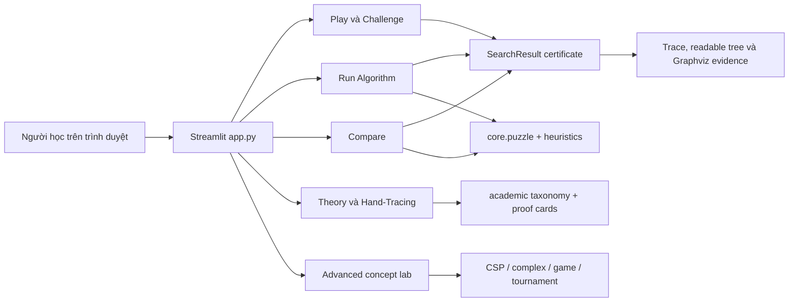

# Kiến trúc hệ thống

## Lớp giao diện

`app.py` là entrypoint Streamlit. File này cấu hình page, session state, language selector, sidebar start/goal, image setup và router tới các tab.

| Tab | Module render | Vai trò |
|---|---|---|
| Play | `ui/play_tab.py` | Chơi thủ công, image tiles, AI replay, challenge score. |
| Run Algorithm | `ui/run_tab.py` | Chạy một thuật toán và hiển thị certificate. |
| Compare | `ui/compare_tab.py` | Benchmark nhiều thuật toán trên cùng preset. |
| Step Trace | `ui/trace_tab.py` | Đọc trace chi tiết và export CSV. |
| Hand-Tracing Practice | `ui/hand_tracing.py` | Người học tự mở rộng frontier và tạo graph evidence. |
| Theory | `ui/theory_tab.py`, `ui/academic_panels.py` | PEAS, taxonomy, proof cards, rubric và report. |
| Advanced | `ui/advanced_tab.py` | CSP, complex environment, game/chance và Tournament. |

## Lớp domain

`core/puzzle.py` định nghĩa state contract, move hợp lệ, solvability theo parity, scramble và path validation. `core/heuristics.py` tạo heuristic theo goal đang chọn. `core/metrics.py` là contract trung tâm cho mọi run thông qua `SearchResult`.

`SearchResult` tự kiểm tra path evidence trong `__post_init__`:

- `path_verified`: path và actions khớp từng legal move.
- `goal_reached`: state cuối bằng `goal_state`.
- `termination_reason`: `goal`, `model_success`, `timeout`, `resource_limit`, `depth_limit`, `exhausted` hoặc `stopped`.
- `optimality_proven`: chỉ true khi success, algorithm optimal, path verified, goal reached và termination là `goal`.

Search tree có hai lớp hiển thị trong `ui/components.py`: readable tree để người học đọc path, current node, frontier và reached snapshot; Graphviz DOT để audit toàn bộ parent-child edge đã ghi nhận. Cách này tránh ép cây lớn vào một ảnh quá nhỏ nhưng vẫn giữ bằng chứng đầy đủ.

## Lớp thuật toán

Solver chuẩn nằm trong `algorithms/uninformed.py` và `algorithms/informed.py`. Chúng nhận `start`, `goal`, giới hạn tài nguyên và trả `SearchResult`.

Demo đối chiếu và extension nằm trong các module riêng:

- `algorithms/local_search.py`: local search và stochastic local search.
- `algorithms/csp.py`, `algorithms/csp_ac3.py`: mô hình CSP và AC-3 state-chain.
- `algorithms/complex_env.py`: AND-OR, belief-state, partial observation, LRTA*.
- `algorithms/adversarial.py`: Minimax, Alpha-Beta, Expectimax.

`core/solver_dispatch.py` là lớp bảo vệ kwargs từ UI. Module này tránh truyền tham số không thuộc signature của từng solver, nhất là với CSP explanatory functions và các demo có `max_steps`, `max_iterations` hoặc `time_horizon`.

`ui/belief_controls.py` gom editor known-tile matrix 4x4 cho No/Partial Observation. Người học có thể nhập `_` cho ô chưa biết; solver vẫn giữ hidden actual state chỉ để debug, còn quyết định mô hình dựa trên belief set.

## Ranh giới học thuật

Standard solver lab chỉ xếp hạng các thuật toán phù hợp với 15-puzzle deterministic fully observable. Advanced concept lab giữ các mô hình mở rộng tách biệt:

| Nhóm | Ranh giới |
|---|---|
| CSP | Có thể mô hình hóa planning theo horizon, nhưng không phải hướng tự nhiên nhất cho 15-puzzle sâu. |
| AC-3 | Chứng minh exact-horizon path hoặc domain wipe-out cho `T` đã chọn, không chứng minh shortest path toàn cục. |
| AND-OR/belief-state | Dùng khi transition hoặc sensor bị đổi có chủ ý. |
| LRTA* | Online learning, không thay thế A* offline. |
| Minimax/Alpha-Beta/Expectimax | Game/chance extension, không có MIN player trong PEAS chuẩn. |
| Tournament | Chấm điểm hai solver agent bằng A* reference, không biến puzzle thành adversarial environment. |

## Tournament flow

`core/ai_vs_ai_tournament.py` chạy mỗi round theo thứ tự:

1. Sinh hoặc nhận start/goal.
2. Chạy A* reference để lấy optimal cost.
3. Chạy solver A và solver B với seed/action order đã cấu hình.
4. Kiểm tra path hợp lệ, goal reached, excess cost và score reason.
5. Tie-break theo tổng điểm, số round optimal, số round solved và total excess cost.
6. UI replay hai trajectory trong `ui/tournament_replay.py` trên cùng timeline.

Nếu A* reference không chứng minh được optimal path, round được đánh dấu reference failed và không dùng để chấm điểm.

## Dữ liệu và triển khai

Ứng dụng không dùng database, backend service, auth hoặc secrets. Runtime chính là Python + Streamlit + pandas + Pillow. Ảnh mẫu nằm trong `ui/assets/`; GIF minh họa README nằm trong `docs/assets/`. CI chạy compile, pytest coverage và Streamlit health smoke test trên nhánh `master`.

## Tài liệu liên quan

- [Tóm tắt codebase](./codebase-summary.md)
- [Chuẩn code](./code-standards.md)
- [Hướng dẫn triển khai](./deployment-guide.md)
- [Kế hoạch kiểm thử](./algorithm-test-plan.md)
