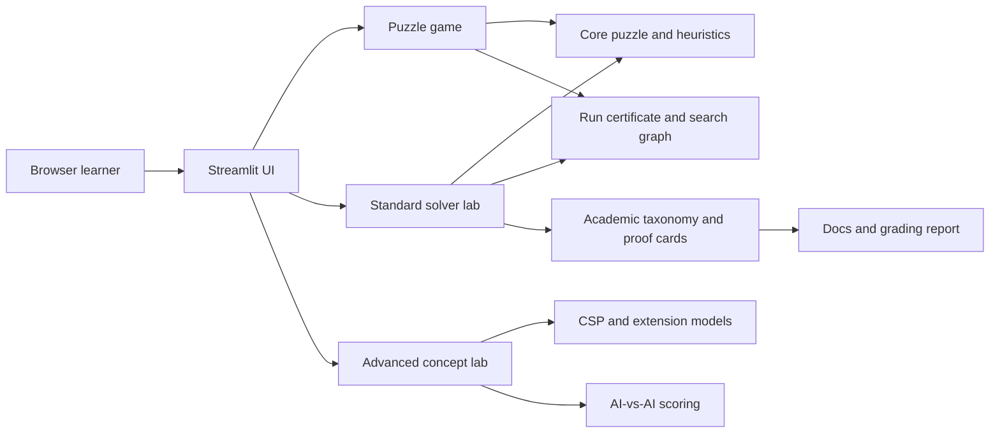

# System Architecture

The standard solver lab accepts only deterministic 15-puzzle algorithms. Extension environments remain isolated in the Advanced concept lab and are not ranked against standard solvers.

Every successful puzzle run contains a legal state/action path certificate. Goal termination and optimality are reported as separate run fields so path legality is not confused with a proof of goal reachability or optimal cost. Extension demos provide contextual termination reasons instead of reusing the 15-puzzle `goal` label when they are not solving the standard puzzle. The search visualization draws an edge only when applying its recorded action to the parent produces the child state. Trace capture is bounded for browser responsiveness and reports truncation explicitly.

AI-vs-AI Tournament runs two selected solver agents on identical 15-puzzle rounds and scores them against an A* optimal reference. Solved paths are normalized by `optimal_cost / actual_cost`; deterministic solution-quality fields break ties, while runtime and node counts remain descriptive evidence. Each scored result retains its certified path/actions for synchronized two-board replay in `ui/tournament_replay.py`. It is an evaluation layer over solver outputs, not a MIN-player environment. Game-tree and stochastic demos expose selected variations or sample outcome paths for teaching; their guarantees remain conditional on depth, timeout, action ordering, and environment assumptions.

All heuristic-driven solvers and demos bind their heuristic to the run's requested goal state. This keeps custom-goal experiments academically consistent with the standard-goal classroom flow.

Solvability checks are also goal-relative: two board permutations are considered mutually reachable only when their 4x4 parity classes match.

Belief-state demos generate auxiliary hidden states by scrambling from the requested goal, so custom-goal parity remains consistent even when the goal is not the standard board.

Interactive Run and Advanced executions receive a fresh UI variation seed on every button click. The seed drives the displayed action order, tie-break choice where supported, and stochastic solver seed. This makes repeated demos less visually fixed without changing solver signatures or weakening the strict path, goal, and optimality certificates. Benchmark, Tournament, and Hand-Tracing flows remain reproducible by explicit seeds and action order.

Group 5 constraint propagation is implemented in `algorithms/csp_ac3.py` as AC-3 over a bounded state-chain CSP. Variables `S[0]..S[T]` hold complete legal puzzle states, endpoints are fixed to the requested start/goal, and adjacent variables must be one legal blank move apart. The result is an exact-horizon path certificate or domain wipe-out evidence; it is not promoted into the standard solver leaderboard.

`core/algorithm_comparison.py` supplies structured within-group rows for theoretical time, space, step/output behavior, and guarantees. The Theory/PEAS UI renders these rows beside the selected group's detailed academic content.

Academic documentation is treated as part of the product surface. The Vietnamese algorithm-group reference mirrors the implemented taxonomy, proof cards, heuristic functions, and advanced-lab boundaries so exam-facing claims can be checked against code instead of being free-form prose.
